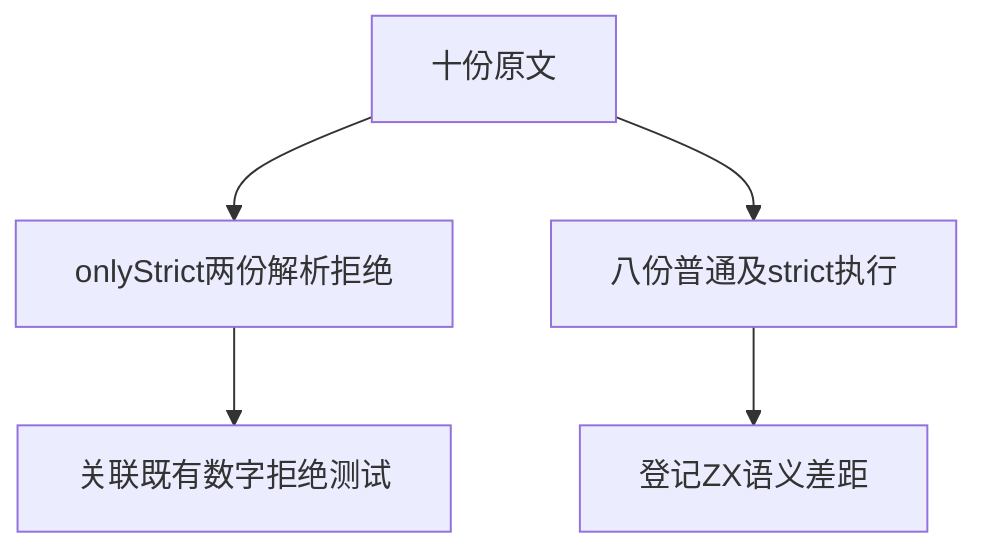

# Test262数字字符转义验证

## Intent：最终目标

审阅十份数字、NUL与十六进制字符转义原文，复用数字转义拒绝适配并补齐完整十六进制转义的ZX拒绝边界。

## Data：可用证据

两份onlyStrict的数字1/7转义parse负例，八份控制字符/NUL/两位hex转义正例。完整原文已逐份阅读；当前lex.zig拒绝数字、u、x转义。普通与插值的数字1/7案例已经存在并被前端专项验证。

## Edges：边界与限制

onlyStrict只验证严格模式，不把非严格允许的八进制转义当成失败。两份适配复用既有案例，不把重复关联计为新增ZX案例；其余八份excluded。新增hex_zero/hex_letter只是当前ZX拒绝边界。

## Answer：交付与成功标准

上游SHA、主体和模式核对；两次仅解析拒绝、十六次真实原文执行；新增四项ZX精确词法断言，完整前端、类型、格式、生成与目录审计通过。

## 自我复核

JS的合法hex转义与ZX的统一拒绝含义不同，不能将反向结果标成通过适配。只补完整合法JS片段与此前残缺hex片段的区别，不扩增无意义的字符排列。

## 阶段300实际结果

完整前端退出0，5/5步骤、5,226/5,226测试通过，净增4项。十份原文SHA和主体核对、两次strict仅解析拒绝、16次正例执行通过。生成、审计、类型、格式与diff检查通过。两份适配仅复用既有数字转义案例，关联去重数未增加。

目录64,612（前端5,226），上游1,344/53,597（612适配103等价629排除），未审阅52,253，关联4,534。没有生产实现缺陷，未发消息，未重复完整根。
