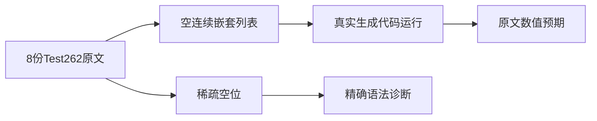
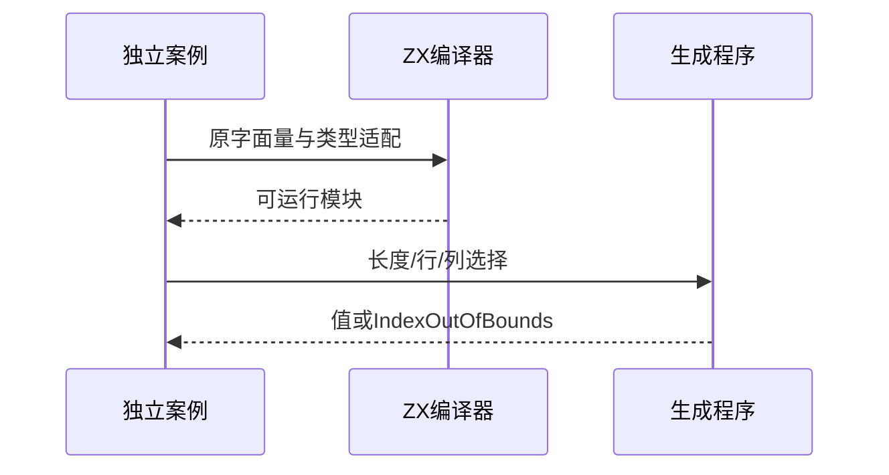

# Test262数组字面量验证

## Intent：最终目标

执行ZX支持的空列表、连续列表和嵌套列表语义，对稀疏空位单独记录语法边界。

## Data：可用证据

完整读取固定Test262数组目录A1.1至A1.7及A2共8份原文，保存原始字面量、哈希和CHECK计数。长度、索引结果直接从原文条件取得；不使用错误消息里的笔误。沿用既有control运行器及JSONL格式。

## Edges：边界与限制

仅适配原文长度与数值元素检查，JS typeof/instanceof/原型方法检查没有ZX等价项。数字1至5用u64精确子集适配，数组改为显式同质列表。稀疏空位不替换为undefined、null或0。Context相关测试保持停止，新增独立数组专项。

## Answer：交付与成功标准

新增实际运行用例与稀疏语法拒绝案例；嵌套访问分别覆盖先取子数组与直接双索引。附加越界情形遵循ZX显式IndexOutOfBounds，不宣称与JS undefined等价。独立原文执行和证据检查通过后登记审阅。

## 实际结果

新增21个真实执行案例（17个上游长度/元素断言、4个ZX越界扩展）与5个稀疏字面量拒绝案例。三个正式源码目录按用途分为空、连续、嵌套列表，而不是堆在同一目录。保留嵌套子数组别名与直接双索引两种路径，动态行列参数用于越界边界。

`zig build test-array-literal test-frontend -Dfrontend-filter=language/types/array_literal --summary all`：25/25步骤26/26通过，日志 `/tmp/zxc-array-literal-final.log`。只运行这两个指定专项，没有运行Context测试。生成器--check、TypeScript检查、目录审计通过，日志为 `/tmp/zxc-array-literal-{generated,typecheck,audit}.log`。

独立参考脚本核对8份原文哈希和75个原始CHECK，并在各原文CHECK之前的实际JS状态中计算17个数值表达式，全部与运行预期相符。4个越界扩展用数组实际行长独立确认越界，未把JS undefined当作ZX错误。日志 `/tmp/zxc-array-literal-reference.log`。原文75个CHECK整体执行通过不等于ZX覆盖75项，JS类型/原型断言未适配。

首次测试宿主给void输入编码null导致一个测试编译失败，其他25项通过。既有control目录不提供void输入编码，因此空列表测试采用未使用的u64载体输入0，生成代码仍实际构造空列表并读取length。未改生产代码或通用运行器，未将宿主格式问题报为编译器缺陷。

目录63365（前端4789、普通运行46586），上游686/53597（436适配、103等价、147排除），剩余52911、关联3871。草稿保留生成器、三个程序及目录数据、稀疏案例与审阅记录，逐字节一致。

## 自我复核

数值子集使用u64保持1至5精确值，不证明所有JS Number数组行为。稀疏空位拒绝只证明语法边界，不能证明稀疏长度和原型。附加越界是ZX契约扩展，不冒充JS等价行为。空列表的输入载体不影响被测列表语义。没有新生产缺陷，没有Context测试，未执行全仓库回归；后续继续扩展数组字面量求值顺序与支持能力。
