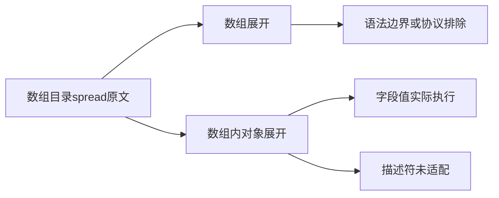
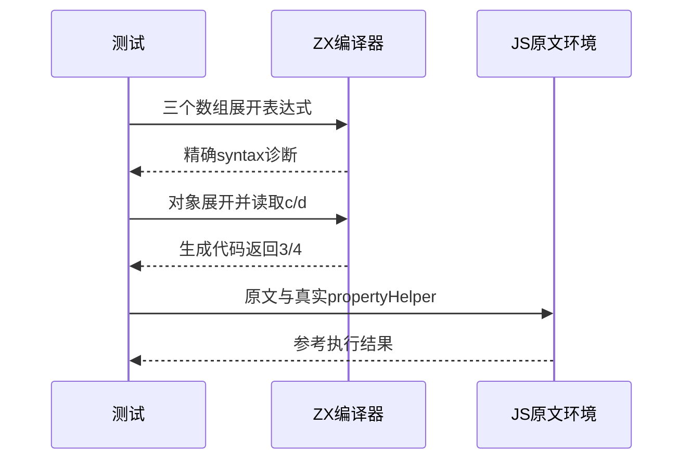

# Test262数组展开与对象复制边界

## Intent：最终目标

区分数组元素展开的迭代协议与数组内对象数据复制，并分别建立符合ZX当前契约的证据。

## Data：可用证据

完整阅读spread-sngl-empty/expr/iter/literal/obj-ident五份原文。前四份使用数组spread和apply，最后一份实际为[{...o}]且verifyProperty包含字段值及描述符。

## Edges：边界与限制

ZX没有动态Symbol.iterator协议，[]中的spread不能以concat替代后声称原协议已实现。对象数据展开可运行但不代表JS描述符语义。Context相关测试停止。

## Answer：交付与成功标准

三个保留原spread表达式的精确syntax诊断，两个对象复制字段值实际运行，动态迭代器一份排除。原文使用固定上游真实harness执行，避免简化verifyProperty忽略描述符检查。

## 实际结果

新增2个对象复制字段值运行案例与3个数组spread语法拒绝案例。源码保留[...[]]、[...[3, 4, 5]]及[...target = source]，syntax精确覆盖三个点；赋值表达式和未初始化target本身未因此验证。动态Symbol.iterator用例排除，不以固定数组替换迭代器。

对象场景保留[{...o}]，生成代码读取c和d返回3/4。verifyProperty原文中的三个描述符标志没有ZX对应检查，仅部分字段值被适配。

`zig build test-object-construction test-frontend -Dfrontend-filter=language/types/array_spread --summary all`：29/29步骤16/16通过，包含5新增与11既有对象运行案例，日志 `/tmp/zxc-array-spread.log`。生成器--check、TypeScript与审计通过，日志 `/tmp/zxc-array-spread-{check,typecheck,audit}.log`。

参考执行读取固定版本真实sta.js、assert.js和propertyHelper.js，并保存三份辅助库SHA256。五份原文在独立VM中全部通过，其中verifyProperty实际检查两份描述符；将首个enumerable预期由true变为false后，真实harness抛Test262Error，验证没有漏掉该检查。日志 `/tmp/zxc-array-spread-reference.log`。参考结果不计为ZX描述符支持。

目录63476（前端4827、普通运行46599），上游701/53597（444适配、103等价、154排除），剩余52896、关联3890。五份正式生成文件草稿逐字节一致，本次diff通过。

## 自我复核

文件位于array目录不意味着正文只测试数组展开，必须按实际表达式区分。本文保留了对象复制与动态迭代器的不同支持边界。没有修改生产代码，没有新生产缺陷；没有运行Context测试或完整入口。静态语法拒绝不能证明迭代结束、next值或apply调用行为。
