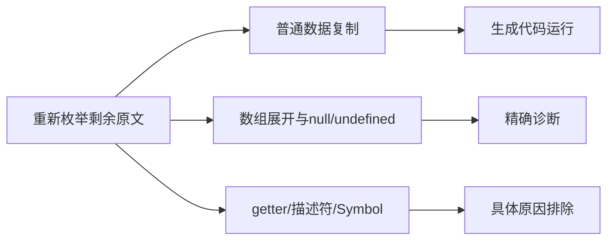
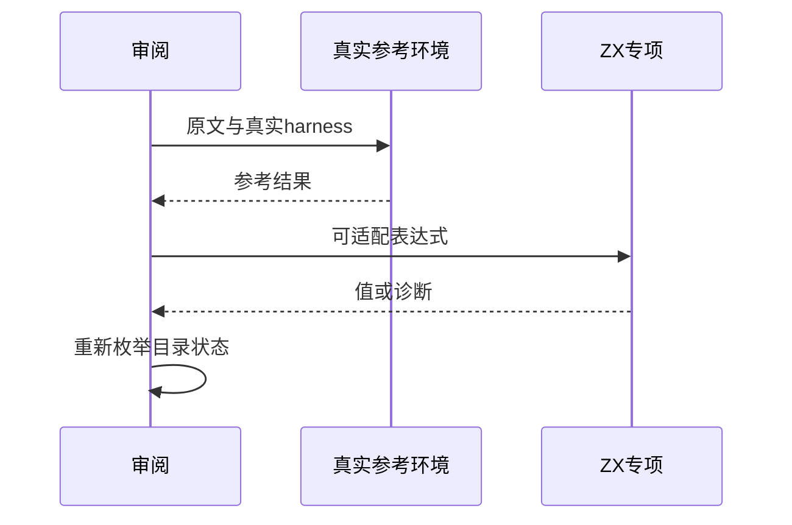

# Test262数组展开协议与目录复核

## Intent：最终目标

审阅数组目录剩余展开用例，执行支持的普通字段复制，对null/undefined和迭代/访问器协议分别登记边界。

## Data：可用证据

重新枚举未审阅文件并读取全部正文，记录固定SHA256及实际apply中的数组表达式。按原文区分多元素数组spread、对象字段复制、空值忽略和动态属性协议。

## Edges：边界与限制

getter次序中的整数/字符串/Symbol键顺序不是静态字段LR求值顺序。删除不支持字段会改变原对象，因此不以部分数值冒充Symbol/身份混合用例。Context测试继续停止。

## Answer：交付与成功标准

4个普通字段值运行及7个数组/空值展开边界；其余明确排除。使用真实上游辅助库执行原文，最后重新枚举目录，逐文件确认审阅状态。

## 实际结果

剩余18份登记8适配、10排除。新增4项a/b/c/d字段值实际执行，3项数组spread syntax、2项null type_mismatch、2项undefined name精确span检查。未将null/undefined展开改写为空对象。

限定命令 `zig build test-object-construction test-frontend -Dfrontend-filter=language/types/array_spread_protocols --summary all`：33/33步骤24/24通过，含11新增与13既有，日志 `/tmp/zxc-array-spread-protocols.log`。生成器--check、类型检查和审计通过，日志 `/tmp/zxc-array-spread-protocols-{check,typecheck,audit}.log`。

真实固定sta/assert/propertyHelper/compareArray环境执行18份原文，验证哈希和完整body，并观察7次实际verifyProperty检查。普通复制的4字段值独立核对为1/2/3/4，日志 `/tmp/zxc-array-spread-protocols-reference.log`。

重新枚举array目录52份文件，27适配、25排除、0未审阅。目录范围全部登记不等于实现全部语义。全上游735/53597（456适配、103等价、176排除），剩余52862；目录63491（前端4838、普通运行46603）、关联3905。

## 自我复核

属性访问器修改后续源对象、不可枚举过滤、Symbol自身属性以及负零/身份混合断言均明确排除，没有删字段凑通过。参考harness执行通过不计ZX协议支持。五份正式文件与草稿字节一致，本次diff通过。无生产修改或新发现缺陷，未运行Context测试和完整入口。
