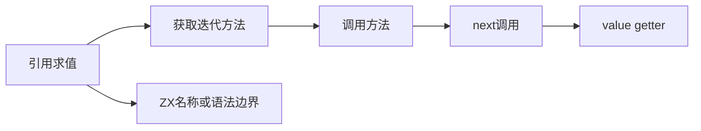
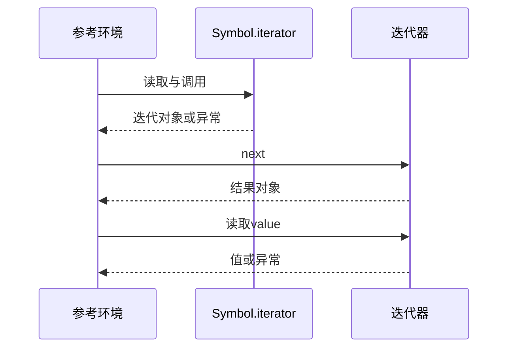

# Test262数组展开异常阶段审阅

## Intent：最终目标

逐阶段识别数组spread错误来源，建立当前ZX支持边界，不把所有抛错混成一类。

## Data：可用证据

固定array目录16份spread-err原文正文已完整阅读；保存SHA256、原错误构造器、阶段分类及完整正文。12份依赖生成器或Symbol.iterator动态机制，4份涉及未解析名称。

## Edges：边界与限制

动态生成器/迭代器/属性getter不在ZX支持范围。对象spread未解析名称可验证分析期name，数组spread更早syntax拒绝；这与JS运行时ReferenceError阶段不同。Context测试继续停止。

## Answer：交付与成功标准

登记12排除、4边界适配；限定前端测试精确阶段、代码和span。原文用固定真实harness验证16个异常，不复制为普通函数错误测试。

## 实际结果

16份原文分别归入引用、迭代方法getter、方法调用、空方法、空迭代对象、next调用、value getter和生成器恢复阶段。名称相似的两份get-value分别是Symbol.iterator getter返回null和迭代方法调用返回null，保留不同原因。value抛错对象未提供done属性，实际在读取value时失败。

新增4个前端案例：2个对象spread未解析名称在analyze/name拒绝，span覆盖完整unresolvableReference；2个数组spread更早在parse/syntax拒绝，span覆盖...。12个动态协议原文排除，无替代调用测试。

`zig build test-frontend -Dfrontend-filter=language/types/array_spread_errors --summary all`：5/5步骤4/4通过，日志 `/tmp/zxc-array-spread-errors.log`。生成器--check、TypeScript和审计通过，日志 `/tmp/zxc-array-spread-errors-{check,typecheck,audit}.log`。

使用固定真实sta/assert辅助库执行16份原文，核验哈希、证据正文及每份唯一异常构造器，计10个Test262Error、2个TypeError、4个ReferenceError。另用独立生成器时序对照确认created在resume之前，防止将函数体错误误记为调用生成器时立即抛错。日志 `/tmp/zxc-array-spread-errors-reference.log`。

目录63480（前端4831），上游717/53597（448适配、103等价、166排除），剩余52880、关联3894。三份正式生成文件草稿逐字节一致，本次diff通过。

## 自我复核

原文异常匹配证明参考JS行为，不能证明ZX具有动态协议。四个边界案例的拒绝阶段不同于JS运行时，明确记录而未抹平。分类根据实际body，不根据文件名或info模板猜测。没有生产修改，没有新发现缺陷；Context和完整test入口未运行。
