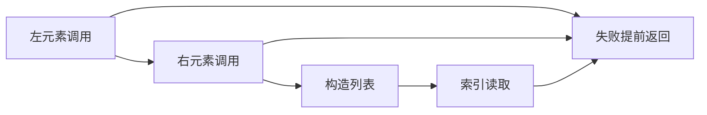
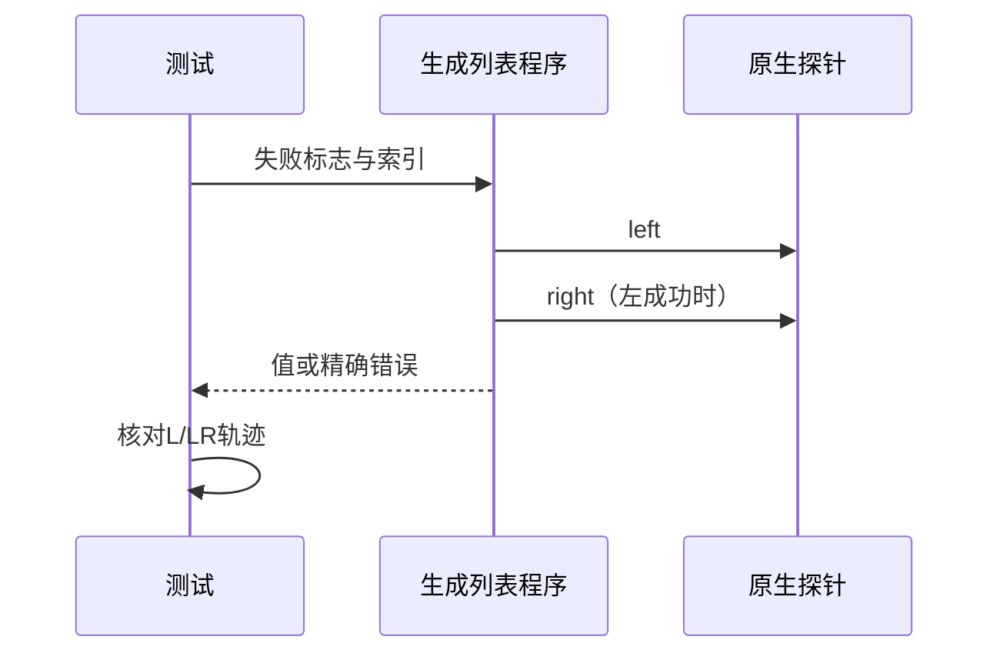

# Test262数组属性与元素求值验证

## Intent：最终目标

区分JS数组自身属性与原型机制，并验证ZX列表构造的实际调用顺序与失败短路。

## Data：可用证据

完整读取11.1.4-0、11.1.4_4-5-1、11.1.4_5-6-1原文。前者实际[,]长度为1，不按容易误读的描述改成0；后两者先定义原型只读索引再要求字面量创建自身属性。沿用已有native左右探针与调用轨迹运行器。

## Edges：边界与限制

Context测试继续停止。原型机制不属于ZX静态列表，明确排除；[,]只登记当前语法边界。24项原生调用顺序测试是ZX扩展，不关联冒充这三份上游断言。

## Answer：交付与成功标准

平面与嵌套列表构造各覆盖左右失败组合及0/1/2索引：成功记录LR，左失败只记录L，右失败记录LR，索引越界须晚于元素求值。结果与精确错误、轨迹共同核对。

## 实际结果

平面与嵌套列表各12个轨迹案例，来自左右失败标志2×2与索引0/1/2的组合。左错误优先于右错误和越界，右错误优先于越界；成功访问预期为2或3。探针写入轨迹后才抛错，测试同时断言L/LR与具体错误或结果，不能以结果正确替代顺序验证。

新增一个[,]前端拒绝案例，三份原文登记为1适配边界、2排除。后两份原文只直接检查hasOwnProperty和数值，并未直接检查新元素writable；记录避免把规范info中的描述当作已断言事实。24个ZX轨迹案例没有关联冒充这两份原型测试。

`zig build test-array-evaluation-order test-frontend -Dfrontend-filter=language/types/array_literal/single_elision --summary all`：15/15步骤25/25通过，日志 `/tmp/zxc-array-order.log`。生成器--check、TypeScript、审计与格式检查通过，日志 `/tmp/zxc-array-order-{check,typecheck,audit}.log`。

参考脚本隔离执行3份原文的5个显式断言，核验哈希；另用真实JS函数调用和显式越界门禁独立执行24种轨迹，全部与目录预期一致，日志 `/tmp/zxc-array-order-reference.log`。JS数组越界本为undefined，参考门禁明确是ZX规则，没有宣称两者天然一致。

目录63390（前端4790、调用轨迹868），上游689/53597（437适配、103等价、149排除），剩余52908、关联3872。七份正式生成文件的草稿字节一致，本次diff检查通过。

## 自我复核

本轮补的是普通元素调用次序，不能推断迭代器spread、原型setter或任意宿主副作用已经支持。探针返回固定2/3是观测夹具，生产列表代码仍执行真实函数调用并按动态索引读取，没有根据测试输入返回预期常量。无生产修改或新发现缺陷；没有运行Context相关测试或完整入口。
