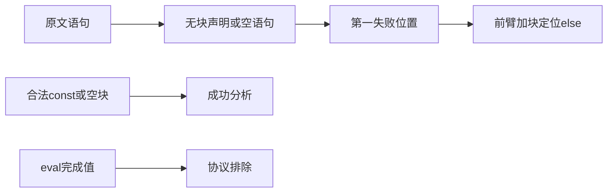
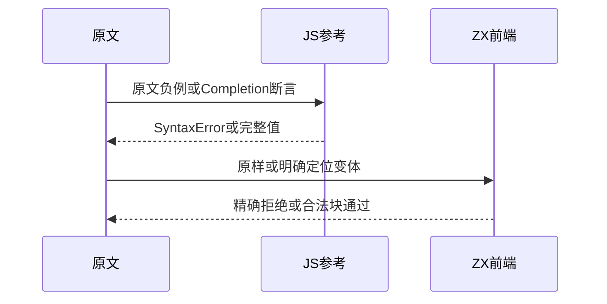

# Test262条件声明位置与完成值

## Intent：最终目标

核验if分支声明位置和空语句边界，独立登记JS语句完成值，不以普通返回值冒充Completion。

## Data：可用证据

完整读取17份原文：8份cptn、8份const/let声明负例与1份空语句。ZX分支必须是块，原文else声明前面的空语句会先触发语法拒绝。

## Edges：边界与限制

else声明定位变体只给前臂加块，并保留else后的非法声明。合法const块使用可选类型声明null，避免混淆缺失类型上下文。完成值涉及eval、UpdateEmpty、break/continue，不是函数返回值；Context相关测试停止。

## Answer：交付与成功标准

9个原始语句边界、2个else定位变体、4个合法const块与1个合法空块对照。完整原文按负例阶段执行，记录真实Completion断言值；ZX门禁精确验证诊断及位置。

## 实际结果

新增16前端：9原始语句、2个else声明定位变体、5个合法块对照。`zig build test-frontend -Dfrontend-filter=language/statements/if_declarations --summary all`：5/5步骤16/16通过，日志 `/tmp/zxc-if-declarations.log`。

17原文完整验证：8个解析SyntaxError，9个执行成功。真实固定sta/assert观察33个完成值断言，26个undefined、7个数值；16个本地结构也经JS参考解析/执行对照，明确空语句在JS合法而ZX拒绝。日志 `/tmp/zxc-if-declarations-reference.log`。

上游登记9适配8排除。生成器--check、TypeScript、覆盖审计、fmt及本轮diff通过。目录63754（前端4946）；上游810/53597（499适配103等价208排除），剩余52787、关联4102。三份正式文件与草稿字节一致。

## 自我复核

原文if(false);else const/let先在前臂分号失败，单凭这两个原样用例无法证明else位置被检查。因此增加前臂{}定位变体，在const/let处精确报错；没有将原文静默改写。合法const块另标注u64?，仅用于证明块位置被接受，不关联上游无块错误。

空语句原文是if(1);，ZX在解析分号时就失败，不能将它解释成数值条件的类型检查。Completion含break/continue且已有值的用例确实产生3或10，不是全部undefined；保持完整动态eval参考，未改写为return。

本轮无生产修改、新发现实现缺陷或Context/完整入口执行。实现会话已确认会检查迁移后的生成器与产物，此处只报告本轮通过范围。
