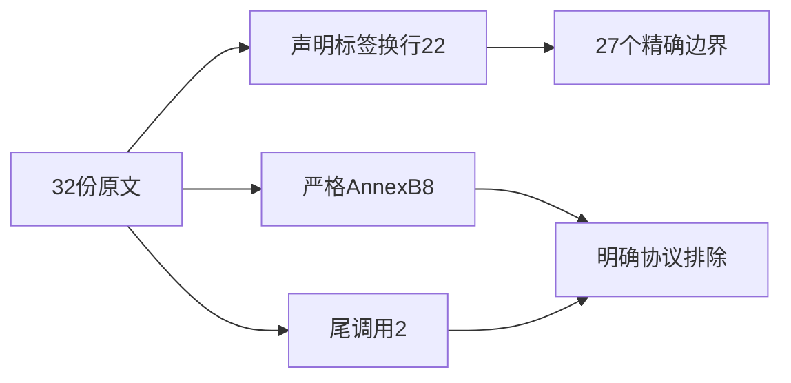
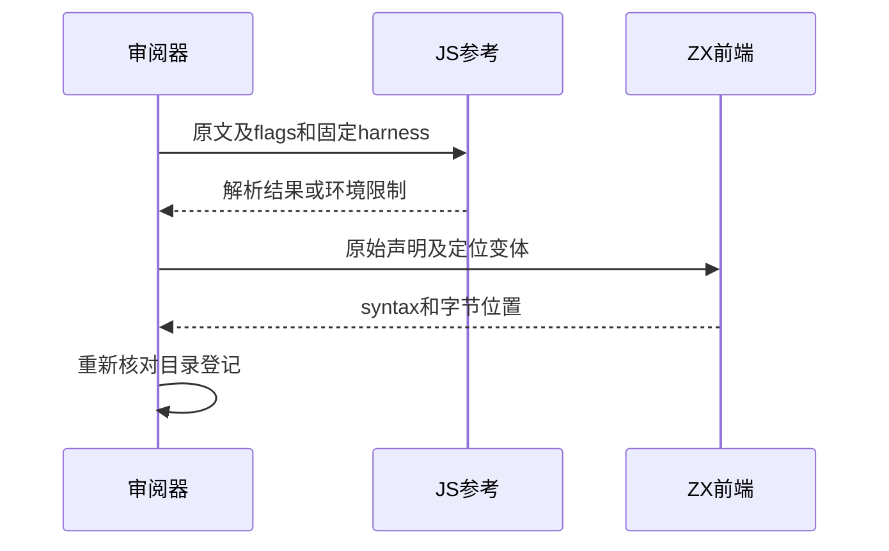

# Test262条件目录剩余语法与审阅复核

## Intent：最终目标

完成if目录剩余原文的逐项审阅，验证函数/类/标签声明位置与let换行边界，保留严格模式和尾调用要求。

## Data：可用证据

重新枚举32份未审阅原文并完整读取。8份严格模式Annex B、2份尾调用、其余22份声明/标签/换行；tcoHelper固定十万次调用。

## Edges：边界与限制

不移除onlyStrict，不用普通无块拒绝冒充Annex B规则；不降低尾调用次数或用循环替代递归。Node参考执行可能不支持尾调用，失败只能说明参考环境限制。Context测试继续停止。

## Answer：交付与成功标准

22个原文边界及5个else定位变体；原文按flags执行或记录参考限制。重新枚举if目录确保审阅记录无遗漏，目录审阅完成不意味着所有功能实现。

## 实际结果

32原文登记22适配10排除，新增27语法边界。限定前端专项5/5步骤27/27通过，日志 `/tmp/zxc-if-remaining.log`。原文28解析负例按flags验证，其中8份onlyStrict同时核验非严格版本可解析；2份let换行正例执行成功。两个尾调用保持固定100000次执行，在当前Node参考环境产生RangeError，已记录环境限制，没有宣称参考通过或缩小迭代。

生成器--check、TypeScript、覆盖审计通过；目录63781（前端4973），上游842/53597（521适配103等价218排除），剩余52755、关联4129。三份正式文件与草稿字节一致。详细参考结果与目录覆盖清单保存在草稿目录。

## 自我复核

严格与非严格对照证明onlyStrict不是可忽略的元数据；这些八份排除而非生成无上下文的伪等价用例。let换行两个原文为JS正例，ZX拒绝仅表示缺少对应语法；标签及else位置保留原文第一失败位置，定位变体单列。目录审阅结束不等于实现全部JS语义。

本轮执行期间用户明确要求移除Context测试。已切换为实际删除要求并核验工作区：实现会话已删除专属文件、注册、草稿；当前保留的context同名项属于Store/缓存/框架能力。详见 `Context测试移除复核.md`，不再沿用“仅停止运行”的旧状态。

if目录重新枚举共69份：47适配、22排除、0未审阅。
