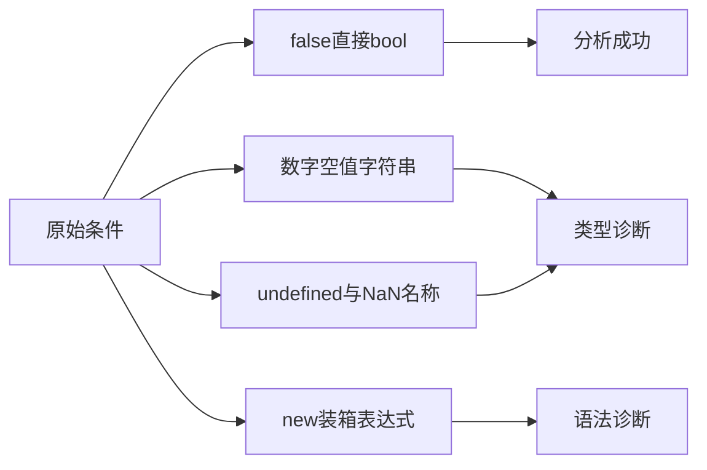
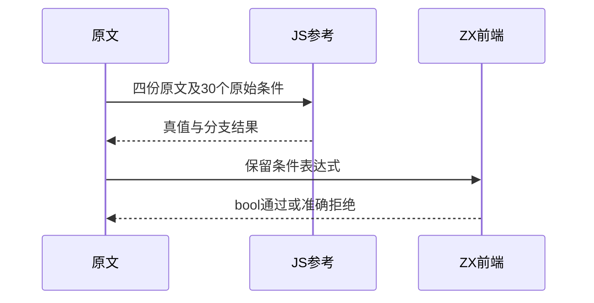

# Test262条件真值与装箱边界

## Intent：最终目标

区分if的直接bool条件与JavaScript隐式真值、装箱对象真值；验证类型信息不会被条件分支忽略。

## Data：可用证据

完整读取四份原文并逐项核对30个if条件表达式。ZX if分析要求bool，undefined/NaN不具有JS内建全局含义，new不是支持的对象构造表达式。

## Edges：边界与限制

保留new Boolean(false)等对象，不拆箱成false。NaN名称拒绝不表示浮点NaN值本身已被求值；命名与数值运行边界分开。Context相关测试停止。

## Answer：交付与成功标准

30项原文条件适配为精确前端阶段/诊断，补充8种输入类型的直接条件约束；独立执行固定原文、核对原始条件的JS真值，运行ZX前端专项及一致性审计。

## 实际结果

新增38前端：12直接falsy条件（两种分支形式各6），18原文装箱逻辑非条件，8种Input类型直接if。仅false及bool类型允许；直接非bool为type_mismatch，undefined/NaN为name，new表达式为parse syntax。失败项均检查字节span。

`zig build test-frontend -Dfrontend-filter=language/statements/if_truthiness --summary all`：5/5步骤38/38通过，日志 `/tmp/zxc-if-truthiness.log`。原文完整固定harness四份执行通过；else计数器分别为6和9，30个原始条件在JS均为false（装箱对象本身为true，经过原文!后为false）。日志 `/tmp/zxc-if-truthiness-reference.log`。

生成器--check、类型检查、覆盖审计及本轮fmt/diff通过。目录63738（前端4930）；上游793/53597（490适配103等价200排除），剩余52804、关联4091。四原文均为边界适配，未增加等价运行语义的结论。三份正式产物与草稿字节一致。

## 自我复核与并行迁移

单独验证if(in)的类型需求，避免只通过逻辑非!拒绝非bool而漏测if本身。bool?即便实际可能有布尔值也不直接作为bool条件；该项是类型规则，不依赖JS参考执行推导。

检查期间并行实现把IR契约迁移到packages/core，生成器路径先更新、已生成reviews仍为旧packages/zx路径，导致首次--check失败。已只重新生成本轮产物并确认一致；向实现会话发送证据，提醒迁移完成后检查历史生成器与reviews。未擅自重写其他阶段产物，也不将本轮检查宣称为整个迁移完成的验证。

未修改生产实现，未运行Context或全量入口；此轮编译结果只证明上述38条前端边界，不证明new、装箱对象或JS真值转换已实现。
