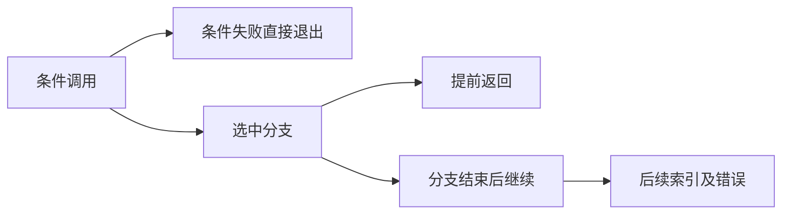
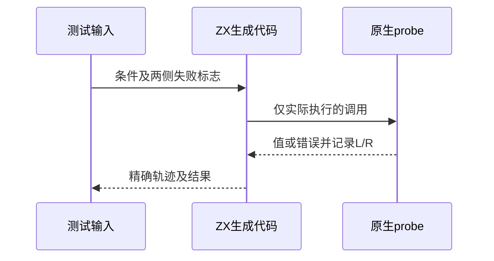

# Test262条件语句与提前返回

## Intent：最终目标

核验if条件先执行、仅选中分支执行、提前返回阻断后续语句，以及未使用的局部绑定初始化仍执行。

## Data：可用证据

完整读取九份S12.5原文；既有probe记录L/R并可独立抛错。当前if语法要求括号和语句块，条件为bool；已有运行轨迹主要覆盖表达式，此处补充语句控制流。

## Edges：边界与限制

JS隐式真值转换不等于ZX bool；条件抛错原文含未定义分支名称，ZX静态检查与JS动态名称解析不同，适配只保留条件错误先于分支求值的部分。JS eval和函数表达式真值不以普通bool冒充。Context测试继续停止。

## Answer：交付与成功标准

生成三个语句形态的48个实际调用轨迹/错误案例，另生成11个前端语法/类型边界；独立JS执行相同语句控制流作为期望对照，核验固定上游完整原文。

## 实际结果

新增59项：3形态各16项运行轨迹，共48；前端8项bool/非bool逻辑非条件与3项括号边界，共11。每个运行案例同时检查结果或错误，以及精确L/R顺序；条件失败阻断后续调用，选中分支失败阻断索引，未选中分支失败标志不产生影响。未使用的const初始化依然调用probe。

`zig build test-if-evaluation-order test-frontend -Dfrontend-filter=language/statements/if --summary all`：19/19步骤59/59通过，日志 `/tmp/zxc-if-statement.log`。真实固定harness验证九份原文：3份解析SyntaxError、6份执行成功；根据实际ZX函数体独立执行JS控制流，并显式加入ZX越界规则，48项轨迹和值/错误全部一致。日志 `/tmp/zxc-if-statement-reference.log`。

上游九份登记7适配2排除。生成器--check、TypeScript、覆盖审计、fmt及本轮diff通过；九份正式文件与草稿字节一致。目录63605（前端4877、运行轨迹952）；上游782/53597（481适配103等价198排除），剩余52815、关联3996。

## 自我复核

A3原文catch只检查捕获到的异常，未显式要求异常必须发生；本轮原生测试更严格，必须观察到LeftFailure及单次L。A5首尾catch会吞掉自行抛出的Test262Error，因此原文本身不足以强证其名称作用域描述，不能据参考执行成功宣称验证完整作用域；此项整体排除。

A4移植使用const初始化承载fallible调用，保留语句执行顺序，但不声称支持JS函数表达式、任意字符串异常或动态catch。后续索引失败是ZX扩展观察点，参考JS显式添加越界检查，未把JS数组undefined误当成错误。

提前返回和if/else两形态选择相反路径，分别观察选中分支调用与继续语句调用，未仅改变名字重复计数。未修改生产源码，未发现新的实现缺陷；未运行Context或完整入口。
