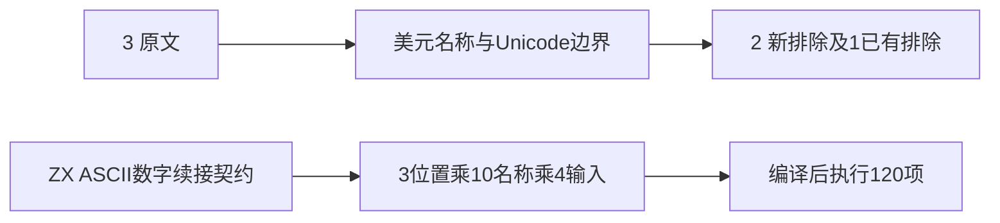
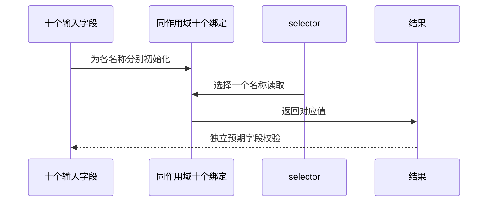

# Test262 标识符数字位置验证

## Intent：最终目标

阶段三百二十九：审阅数字续接原文，并补齐ZX数字名称的实际绑定、读取及同作用域区分验证。

## Data：可用证据

3原文各验证$0到$9，包括字面量、四位Unicode和码点转义。普通形式已在326排除，本轮复核而不重复计数；新增审阅2转义形式。ZX词法接受ASCII数字续接，但lint值名称要求小写字母起始；Unicode标识符转义不支持。保留哈希和正文。新增用例属于ZX特性补充，不把重命名当原文适配。

## Edges：边界与限制

仅测试已有语言契约，不修改生产实现。覆盖a0至a9、a0b至a9b、a_0至a_9三组，每组十个绑定同处一个作用域，初始化为不同输入字段，再按selector逐一读取。输入为递增、递减、全零和交错u64最大值/零四组，共120项。不使用固定返回值代替名称解析。

## Answer：交付格式与成功标准

新增分层运行catalog与生成器、独立专项入口。通过原文6次参考执行、120项实际运行、生成器重复性与矩阵审计。草稿及证据统一保存在标识符数字位置草稿。

## 自我复核

单独作用域仅返回输入无法检出错误的名称合并，故本次每组十名同时存在。数字与位置来自有限语法维度；不同数值输入用于检出串值及宽度错误，不把重复输入当不同上游覆盖。排除的原文不关联新增ZX用例。重复检测在落盘review前识别326已审阅普通形式，保留原记录，仅新增2项。

## 验证结果

`zig build test-identifier-digits --summary all`：21/21步骤、120/120项通过，三个程序均由当前CLI重新生成后执行。原文3文件哈希、正文及6次执行核验通过；其中普通数字形式已有记录，只增加2个转义原文排除。生成器--check、矩阵、格式与diff检查通过。

JSONL总数65194，其中runtime47659；已审阅2036=678 adapted+103 equivalent+1255 excluded，未审阅51561，关联4916。未改生产实现，未发现需发送至实现聊天的缺陷，未重跑完整根回归。
