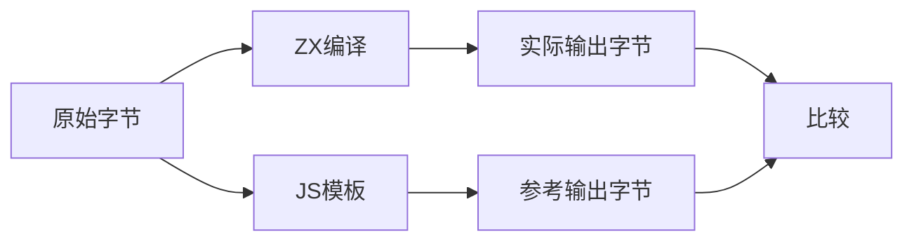
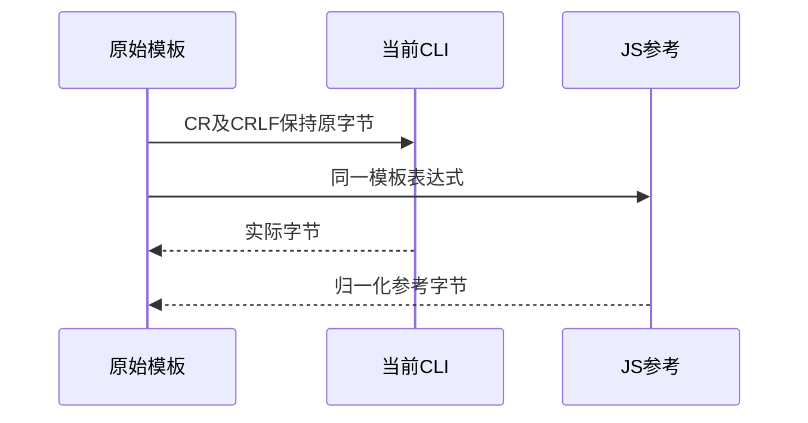

# Test262模板原始换行差异

> 后续状态（阶段242）：两处差异已通过原五字节探针及十四项正式回归关闭，详见《模板原始换行修复复验》。以下保留阶段237原始失败证据。

## Intent：最终目标

保留原始LF、CR、CRLF、LS、PS字节，核对ZX模板输出是否符合Test262的解码值规则，避免文本读写工具先归一化输入掩盖差异。

## Data：可用证据

tv-line-terminator-sequence原文要求CR与CRLF归一为LF，LS/PS保持字符。当前ZX源码契约明确UTF-8及词法空白范围，但没有写模板文本中原始CR的输出规则；模板解码器逐字节保留非转义文本。

## Edges：边界与限制

使用当前源码单独构建CLI；探针仅位于docs，不先将失败结果设为正式预期。上游含tag/raw/调用次数，探针只比较普通模板字符值。差异需反馈实现会话明确契约，不自行扩大修改生产语义。

## Answer：交付与成功标准

五个字节保真源文件、实际生成程序执行及十六进制输出，逐项与独立JS模板结果对照；保存失败日志与源码哈希，明确哪些未对齐，不以排除记录隐藏未决问题。

## 实际结果

当前源码CLI构建通过。五个原始字节模板均完成CLI生成Zig、编译探针、运行；五次都正常退出，区别发生在真实输出字节，而不是词法拒绝或构建错误。

| 原始分隔符 | JS期望UTF-8十六进制 | ZX实际十六进制 | 对齐 |
| --- | --- | --- | --- |
| LF | 410a42 | 410a42 | 是 |
| CR | 410a42 | 410d42 | 否 |
| CRLF | 410a42 | 410d0a42 | 否 |
| LS | 41e280a842 | 41e280a842 | 是 |
| PS | 41e280a942 | 41e280a942 | 是 |

上游原文SHA与固定索引一致，完整strict/sloppy参考执行18项断言通过。同五份ZX源码中的实际模板表达式另由JS执行，得出的参考hex与探针比较预期逐项一致。独立复现脚本因两差异退出1，未改成成功。

## 根因与交接

模板text通过analysis/strings.zig进入通用string_literal.decode，后者对非反斜线字符直接逐字节复制，因而保留原始CR。原始CR归一与显式\r转义必须分开；不应为对齐模板而修改普通字符串或显式转义的值。

已将五个源文件、每步命令、输出hex、SHA及最小复现反馈实现会话，请其明确契约并落实相应行为。当前契约只描述词法空白的CRLF处理，不足以证明模板字节保留是既定设计。

## 自我复核

读写ZX使用bytes接口，JS使用readFileSync原样读取；没有通过Python通用换行转换或格式化器改变探针输入。探针字符串首尾A/B只用于定位字节，不改变换行语义。tag/raw不在ZX探针范围，参考完整原文通过不能替代ZX实际输出。

此原文保持未审阅完成状态，两个差异保持待处理，不借助excluded或放宽预期消除失败。探针留在docs，未注册为全局通过案例；目录数沿用阶段236的63,965，无生产修改、浏览器或全仓库回归。
