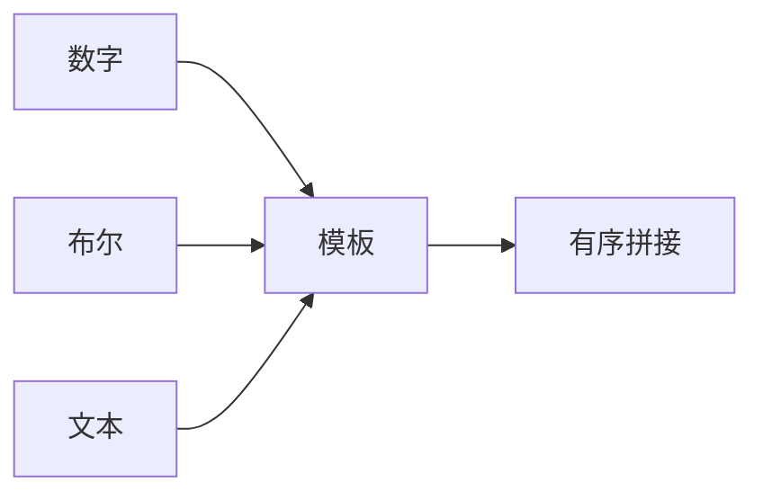
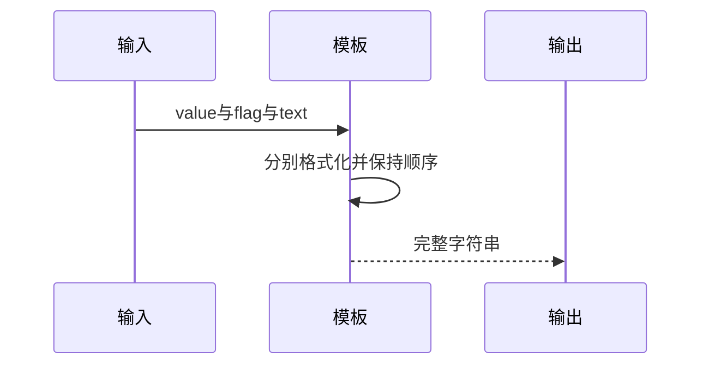

# Test262模板基础值插值验证

## Intent：最终目标

验证模板首段、中段和多个前段之后的数字/字符串插值，扩展动态布尔、负数和文本组合。

## Data：可用证据

三份primitive原文各含数字5和字符串string两断言，实际并无null/undefined或布尔值。本轮完整保留六个值断言，字符串字面量仅由单引号改为ZX支持的双引号。

## Edges：边界与限制

布尔和动态输入为原生扩展，不算原文覆盖；不声称空值、对象ToString或一般浮点规则。Unicode文本只验证原样传递，不涉及UTF-16长度。

## Answer：交付与成功标准

六原文运行、十八动态组合；原文哈希与完整strict/sloppy参考执行；独立预期、类型和目录审计。

## 实际结果

新增24项运行，17/17步骤24/24通过。六项分别来自原文数字/字符串在首段、一中段、多中段之后的位置；十八动态组合验证负数/零/正数、false/true以及空文本/汉字/字面量插值标记。文本中的${literal}保持文本，不发生二次插值。

三份原文SHA与固定索引一致，完整strict/sloppy参考执行12项原始断言通过；六转换后的表达式独立求值等于原预期，实际ZX函数体24输入的独立输出均一致。生成器--check、类型、构建格式和新增文件空白检查通过，七正式副本逐字一致。

目录审计通过：63,999案例（前端5,044、运行46,741），上游1,001/53,597（550适配、103等价、348排除），未审阅52,596；关联4,186。实际运行范围仅本轮24项，不把目录总数表述为本轮全量通过。

## 自我复核

primitive文件名不等于涵盖所有基础类型；原文只有数字和字符串，布尔为本轮原生扩展。引号风格修改保持字符串值，已明确记录在审阅理由。负数、布尔和UTF-8文字结果通过不证明JS完整ToString或浮点格式兼容。

本轮不处理或关闭阶段237原始CR/CRLF差异，未修改生产源码、执行浏览器或全仓库回归；Context专项保持已删除。
