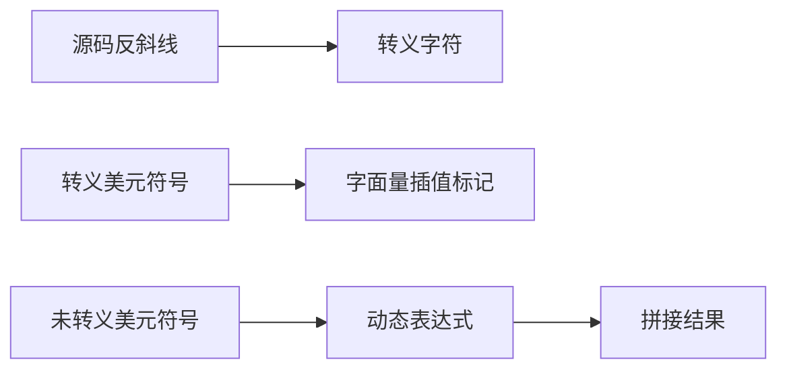
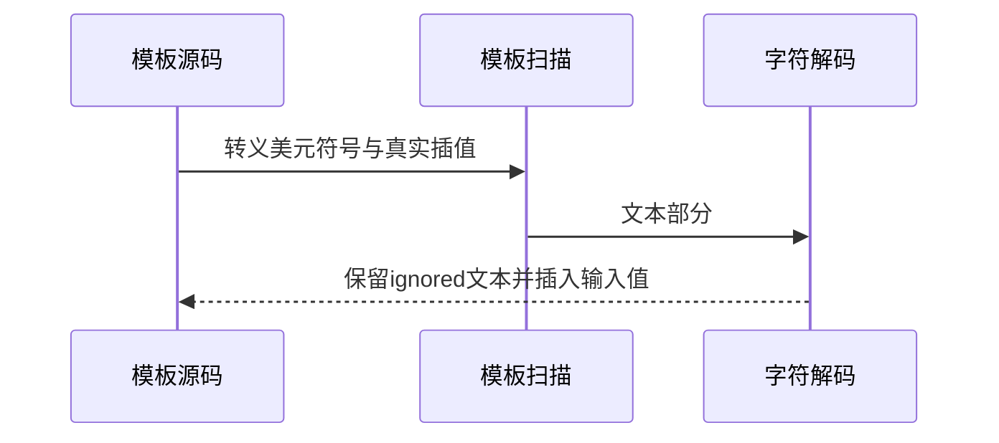

# Test262模板字符与转义验证

## Intent：最终目标

验证支持的模板转义与字符值，检查转义美元符号不会打开插值，同时保留实际动态插值。

## Data：可用证据

完整读取四份原文tv-character-escape-sequence、tv-template-character、tv-template-characters、mongolian-vowel-separator。字符解码器支持n/r/t及转义引号、反斜线、反引号；模板扫描器显式跳过反斜线后的美元符号。

## Edges：边界与限制

前两份原文含tag/raw及调用次数，ZX只保留支持的解码值子集；不声明完整tag协议兼容。未适配单引号/b/f/v转义，也没有将原始CR/CRLF归一化纳入本次结果。

## Answer：交付与成功标准

十项原文字面量值、三项动态转义与真插值共存结果；四份原文完整参考执行及哈希，明确每份适配的断言子集。未解析的ignored名称必须留在文本中。

## 实际结果

新增13项实际ZX运行：十项原文字面量值、三项转义标记与动态插值共存，17/17步骤13/13通过。未声明的ignored不被解析为名称，输出保留其插值标记文本，同时-1/0/1真实输入正确插入。

四原文SHA与固定索引一致，完整strict/sloppy参考执行80项断言通过；十个保留的模板字面量确认存在于原文且独立求值得到预期。实际ZX两函数体独立执行13项与目录一致。参考中tag/raw与调用次数通过不等于ZX支持，适配理由明确仅保留十个值断言。

生成器--check、类型、构建格式和本轮新增文件空白检查通过；七正式副本与当前产物逐字一致。目录审计通过：63,965案例，运行46,707；上游998/53,597（547适配、103等价、348排除），未审阅52,599，关联4,180。

## 自我复核

原文四十断言每模式各执行一次，但ZX只保留十个字面量值及三个原生动态扩展，不能把80写成新增ZX覆盖数。原始换行归一化、行延续、unicode escape和未支持字符转义仍待单独确认；本轮没有通过剥离错误字符或替换预期来扩展支持声明。

未修改生产源码、执行全仓库回归或浏览器检查；Context专项保持已删除。
