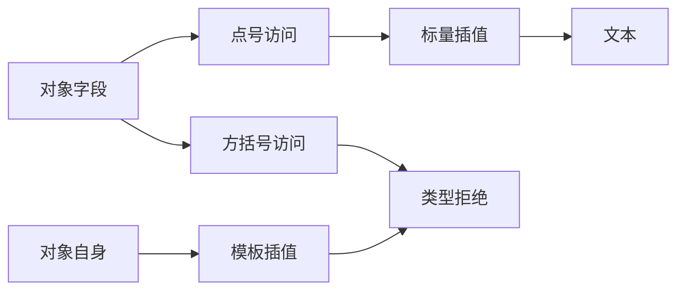
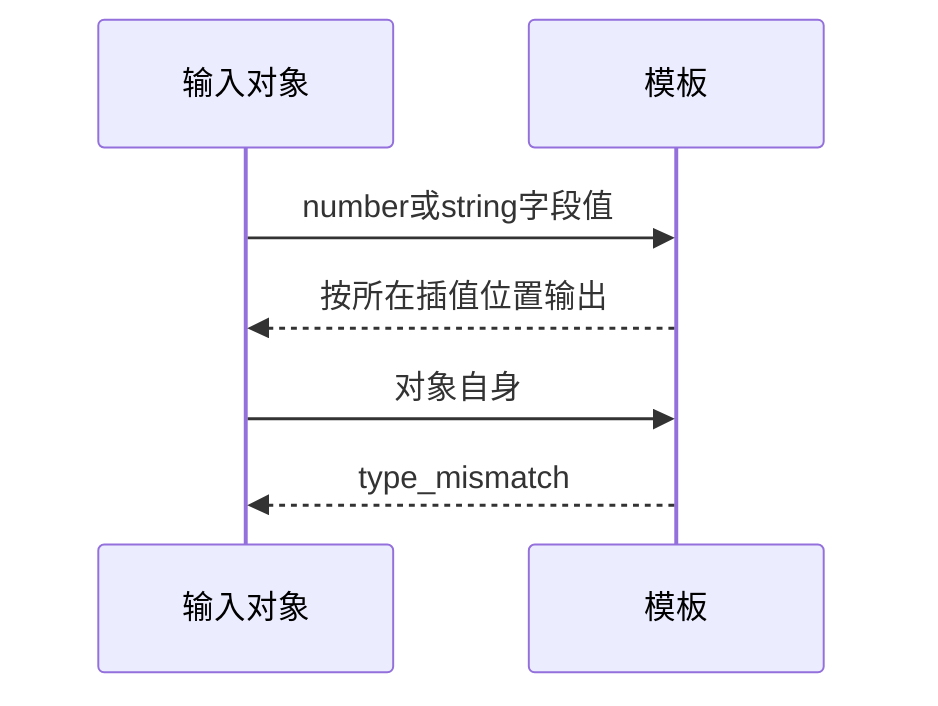

# Test262模板成员值与对象转换边界

## Intent：最终目标

验证模板成员值读取，区分字段值转为文本与对象自身隐式转换；保留原文支持的点号访问而不伪造方括号属性支持。

## Data：可用证据

九原文完整读取：三个member-expr每份四断言（两点号两方括号）、三个obj每份八断言、三个tostr-error每份一断言。ZX索引要求list，模板插值要求非void scalar。

## Edges：边界与限制

三成员原文只适配两点号断言；方括号对象访问不改成点号冒充原行为。六对象转换原文excluded，不把原生类型拒绝关联为JS运行转换通过。动态输入扩展不增加上游数。

## Answer：交付与成功标准

六原文点号运行和六动态成员运行；三个方括号访问和三个对象直接插值精确type_mismatch；九原文SHA及完整参考执行。

## 实际结果

新增18项：12运行（六原文点号字段值及六负数/空串动态对照）、六分析阶段type_mismatch。组合17/17步骤18/18通过。对象索引诊断精确到in["string"]，对象插值诊断覆盖整个模板表达式，符合当前报告位置契约。

九原文完整SHA与索引一致，strict/sloppy参考执行78项断言通过；实际ZX成员函数体12输出独立一致，六诊断位置字符独立核对。三成员记录只关联原文点号访问六案例；六对象转换记录excluded且cases为空，不伪造运行转换支持。

生成器--check、类型、构建格式及本轮新增文件空白检查通过；六正式副本逐字一致。目录审计通过：64,033案例（运行46,753、前端5,050、轨迹1,084），上游1,014/53,597（557适配、103等价、354排除），未审阅52,583；关联4,208。

## 自我复核

middle-list-one/many的对象原文有重复断言，完整参考执行保留它们，但未把重复断言变成额外ZX案例。成员对象由显式Input提供，验证的是字段读取与模板组合，不声称JS var声明或动态对象结构已适配。

实现会话报告根回归及枚举身份修复通过，模板换行修复即将应用；本轮没有据报告关闭阶段237差异，仍需对已应用源码重新执行字节探针。未修改生产源码、运行浏览器或全仓库回归，Context专项保持已删除。
