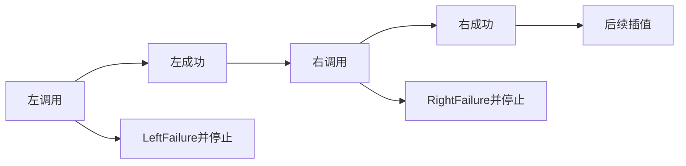
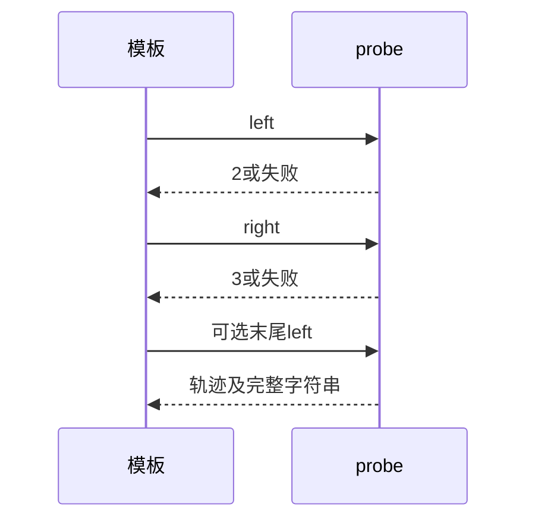

# Test262模板求值顺序与失败传播

## Intent：最终目标

观察模板各插值真实调用顺序，并证明失败后停止后续调用，不能只凭最终字符串推断顺序正确。

## Data：可用证据

完整读取evaluation-order和三个expr-abrupt原文；前者含普通模板自增和tagged调用，后三者以立即调用函数抛Test262Error。现有probe记录L/R并可抛LeftFailure/RightFailure。

## Edges：边界与限制

用可观测原生调用替代自增/立即调用抛异常，保留顺序或插值位置失败传播，不声明tagged协议、自增语法、异常对象类型等价。增加成功和后续调用失败对照。检查器须比较字符串内容，不能比较切片身份。

## Answer：交付与成功标准

四个表达式各四种失败配置，共16项轨迹/输出/失败断言；四原文哈希与完整参考执行；旧标量轨迹专项兼容回归。

## 实际结果

新增16项模板轨迹测试全部通过。首个调用失败时只记录L；右调用失败时记录LR；顺序成功例记录LRL并得到a0b1c2d。三个失败插值位置都有成功字符串和后续右调用失败对照，实际检查器在成功/错误分支之外始终检查轨迹。

与已有36项switch轨迹组合运行：40/40步骤、52/52测试通过。四原文SHA与固定索引一致，完整strict/sloppy参考执行16项原始断言通过；从实际ZX函数体执行的独立原生调用模型16项轨迹/值/错误一致。生成器--check、类型及本轮格式检查通过，13份正式副本一致。

目录审计通过：64,015案例，其中轨迹1,084、普通运行46,741、前端5,044；上游1,005/53,597（554适配、103等价、348排除），未审阅52,592；关联4,202。

## 测试设施修正

首次执行在生成阶段拒绝字符串expected.value，尚未运行模板。为新输出类型扩展emit_logical_trace_tests的string类型及转义字面量生成，并将逻辑检查器expectEqual改为expectEqualDeep按内容比较切片，保留原有类型/错误/轨迹校验。不是放宽新用例预期；旧36标量轨迹同步通过。一次编辑命令工作目录错误没有产生修改，纠正路径后执行上述有效修正。

## 自我复核

原文自增与tagged调用未被ZX实现；只以可观察原生轨迹保留普通模板求值顺序。LeftFailure不等于JavaScript Test262Error对象，适配只证明该插值位置失败沿执行链传播并停止后续调用。

本轮未修改生产源码或关闭阶段237换行差异，未运行全仓库或浏览器。Context专项保持已删除。
