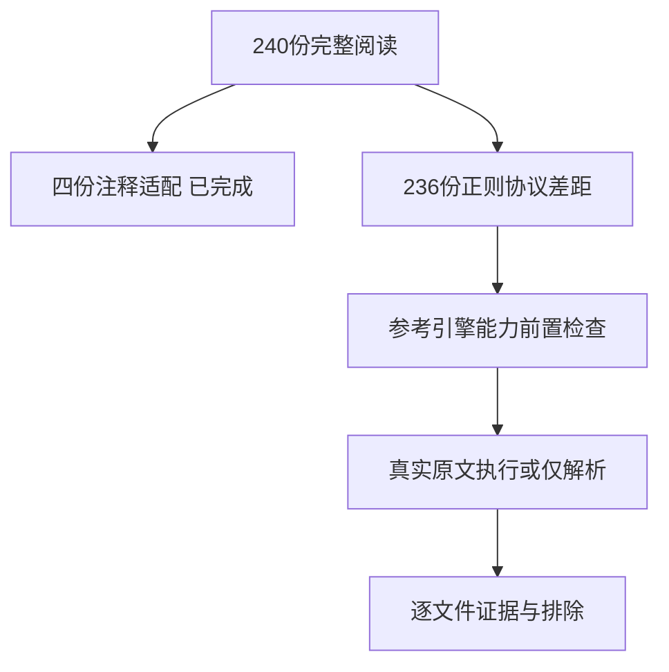
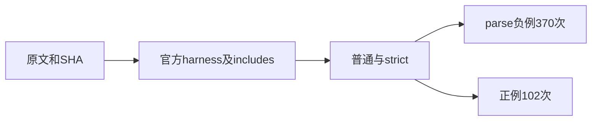

# Test262正则字面量完整审阅

## Intent：最终目标

完成正则字面量目录240份的逐文件判定，在阶段304四份注释语义适配之外，对剩余236份保留准确能力差距和原文执行证据。

## Data：可用证据

只读子代理完整阅读240份，截断处已补读；其中52正例、188 parse负例，无runtime negative、无flags。四份注释例外已独立验证。余下236份为51正例与185 parse负例；18份正例在eval中断言SyntaxError，不能误计metadata runtime negative。只有lastIndex.js额外引用propertyHelper.js。

当前ZX syntax/AST没有regex token或节点，lexer优先识别注释、parser无slash primary、calls无RegExp内置路线。主流程复核当前代码与四个例外，并对参考Node执行前置能力检查。

## Edges：边界与限制

236份均excluded。先验证Node支持局部修饰符添加/删除/混合、命名组、lookbehind、Unicode和sticky，避免旧引擎不认识语法而伪通过parse负例。正例载入官方默认harness与声明includes；parse负例只编译，不执行DONOTEVALUATE。完整目录判定不表示ZX已支持正则。

## Answer：交付与成功标准

原文SHA/主体、370次仅解析拒绝及102次实际执行全部通过，保存引擎版本、能力检查和逐文件结果，再登记236份排除与完整目录覆盖。任何原文失败都保留具体文件与模式，不降格为通过。

## 原文结构核对

- regexp-modifiers共83份，全部parse负例；包含58份添加/删除与25份简单修饰符限制。
- named-groups共56份，54 parse负例，2正例（一个前向引用、一个eval拒绝孤立代理组名）。
- lookbehind若干负例未标对应feature，因此不能只凭metadata选择前置检查。
- lastIndex.js验证属性描述符，不能只测数值0。
- inequality及A4.2验证对象身份，普通文本相等不能替代。
- 数个文件有残留模板式注释；保留锁定原文，不自行扩成新用例。

## 自我复核

静态类型设计不从逻辑上禁止未来正则能力，但当前没有实现，所以不将全面拒绝作为语言兼容证据。节点能力检查只为提高参考原文核验可信度，不证明ZX支持相关特性。

## 阶段306实际结果

Node v25.8.1七项合法语法/匹配能力前置检查全部通过；236份原文SHA/主体、370次仅解析拒绝、102次实际执行通过，完整逐文件结果和原始日志已保存。目录审计通过，正则目录240/240已审阅、剩余0；四份注释适配已在阶段304实际验证，其他236份明确excluded。

上游1,676/53,597（619适配103等价954排除），未审阅51,921；JSONL64,646和关联4,549不变。没有新增ZX正则实现或测试，不重复前端/根回归，没有实现缺陷通知。

自我复核：默认harness和propertyHelper均按原文装载；parse负例未执行。参考引擎支持合法局部修饰符、命名组等的证据已保存，减少“引擎完全不认识语法”导致的假阳性。此结果仅证明锁定原文可核验和分类完整，不代表ZX正则能力已实现。
