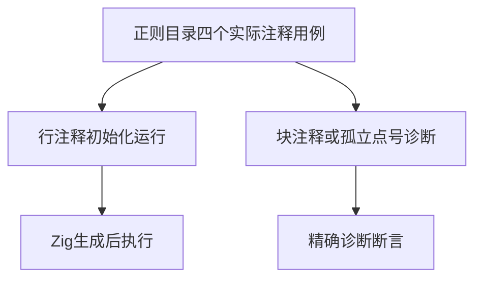
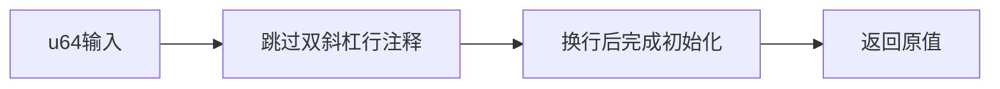

# Test262正则定界与注释执行验证

## Intent：最终目标

从正则目录中识别四份实际属于注释/语法边界的原文，验证ZX已支持的对应行为，避免目录级排除。

## Data：可用证据

只读子代理完整审阅240份正则原文并指出四个例外；主流程独立阅读四份源码，确认一份 //.source; 后换行取y，另三份是未闭合块注释或行注释后的孤立点号。当前CLI已成功生成对应正向初始化结构。

## Edges：边界与限制

不提供RegExp实现。正向保留注释与跨行初始化结构，将y换成显式u64输入，覆盖LF/CR/CRLF和0/42/最大值；三份负例必须检查具体类别和跨度，不接受任意错误。parse负例原文不执行。

## Answer：交付与成功标准

新增九项运行和三项前端，四份原文适配。SHA/主体、六次仅解析拒绝和两次原文执行通过；新运行与完整前端、类型、生成审计和格式通过。

## 自我复核

目录名称和元数据描述不能代替实际源码阅读。原文parse负例的语义原因已独立确认，未将“不支持正则”当成测试通过依据。

## 阶段304实际结果

四份原文SHA/主体、六次仅解析拒绝、两次实际执行通过。正式专项退出0，25/25步骤、5,256/5,256测试通过：新运行9项和完整前端5,247项（新增3项）。生成一致性、审计、类型、Prettier、Zig格式及diff空白通过。

目录64,646（运行47,169、前端5,247），上游1,381/53,597（619适配103等价659排除），未审阅52,216，关联4,549。没有生产实现缺陷，未发消息，未重跑完整根。
