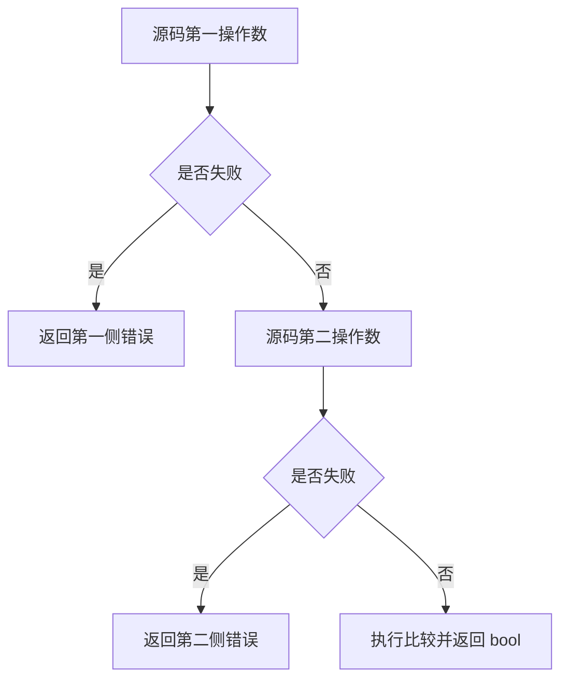

# Test262 比较运算求值轨迹

## Intent：最终目标

验证六种比较运算的真实操作数调用顺序、单次求值及失败传播。尤其 > 与 <= 不能因为比较实现的数学变换而交换源码操作数调用顺序。

## Data：可用证据

已有 evaluation_order 外部探针记录 L/R 并能分别返回 LeftFailure/RightFailure，编译和执行真实生成 Zig。已逐项读取固定上游 <、>、<=、>= 的 S11.8.x_A2.4_T2.js，均要求第一操作数抛错后不执行第二操作数。

## Edges：边界与限制

ZX 没有源码 throw/try-catch；以现有 fallible native 接口适配异常，保留错误身份与执行轨迹。此处验证操作数求值，不验证对象 valueOf/ToPrimitive 转换顺序。数值选小整数避免浮点舍入干扰，NaN/无穷比较由既有 IEEE 测试负责。

## Answer：交付与成功标准

6 运算符 × 2 源码操作数排列 × 9 数值对 × 4 失败组合，共 432 个独立命名案例。每例断言返回值或精确错误及完整轨迹；双失败只允许源码第一侧记录一次。登记生成一致性，接入现有 evaluation_order 专项。

## 执行结果与自我批判

新增 432 个真实生成代码执行案例，`comparison.zx` 的两个探针调用保留在比较操作数中，未提前缓存两个操作数从而掩盖编译器排序行为。每侧通过小整数偏移恢复输入值；左/右/相等数值关系与四种失败组合均覆盖。

Debug 求值轨迹专项 **30/30 步骤、765/765 测试通过**，日志 `/tmp/zxc-comparison-trace-final.log`。首次草稿使用 ZX 不支持的 case 语句块而解析失败；改为已有直接 return 分支后通过，不涉及生产修复。TypeScript、生成一致性、目录审计、Zig 格式与 diff 检查通过。

四个上游原文件逐一读取并核验哈希，新增 4 adapted。每个文件关联对应运算符全部 72 个案例，逐条校验 trace 和 value/error。总登记 57,564：runtime 42,516、frontend 3,138、evaluation_order 764、safety 464、module_graphs 10,446、stores 236。上游累计 308/53,597（173 adapted、102 equivalent、33 excluded），未审阅 53,289，唯一关联案例 1,278。

自我批判：此适配保留操作数求值与首错传播，但 native error 不等于完整 JavaScript 异常机制；不把这些结果套用到对象转换顺序。相同值组合也保留调用断言，避免比较结果恒定时遗漏求值。没有生产源码修改或新缺陷；最近完整根为阶段 83，本轮不复跑整仓。

ReleaseSafe 求值轨迹专项同样 **30/30 步骤、765/765 测试通过**，日志 `/tmp/zxc-comparison-trace-safe.log`，优化构建保留相同顺序和失败行为。
