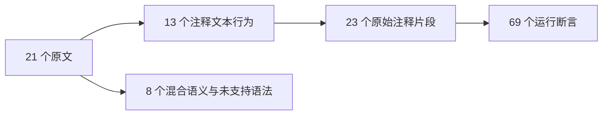
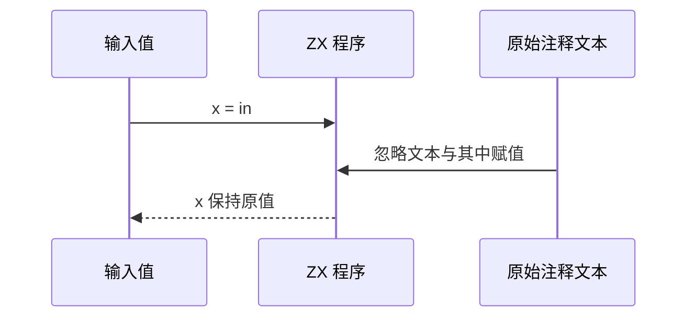

# Test262 注释内部字符验证

## Intent：最终目标

阶段三百一十七：覆盖注释内部控制字符和 Unicode 字符的原文语义，区分注释文本与代码空白。

## Data：可用证据

逐文件读取 21 个尚未审阅原文：10 个空白字符注释、3 个蒙古元音分隔符注释、2 个综合注释文件、4 个注释内换行 ASI、2 个 HTML 注释负例。前 13 个可保留注释文本并验证其无运行副作用。

## Edges：边界与限制

eval 内字符串解码为静态源代码，保留注释内容；不声称实现 eval。综合文件包含未初始化变量、this、NaN 等不支持语义，不只摘取其中恰好可用的片段作为全文件覆盖。ASI 表达式语句和 HTML 注释语法排除。NBSP 和 U+180E 在注释内可用，不代表代码区将其视为空白。

## Answer：交付格式与成功标准

13 个文件的 23 个注释片段分别生成模块，在 0、42、u64 最大值输入下保持原值，69 项运行断言。8 个文件明确排除。原文哈希、参考执行、生成器重复性、矩阵和运行专项需通过。

## 自我复核

注释文本含 x = 1 但运行变量保持输入，验收通过实际生成执行完成。不同字符与片段各自成例，参考引擎结果不计作 ZX 运行用例。

## 实际结果

运行 `zig build test-comment-characters --summary all`：101/101 步骤、69/69 测试通过。原文 21 个 SHA 与正文核验通过，官方 harness 38 次执行、4 次仅解析拒绝通过。生成器重复性和矩阵通过，13 adapted、8 excluded。

最新 JSONL 64829，其中 runtime47352；上游已审阅1759=612 adapted+103 equivalent+1044 excluded，未审阅51838，关联4691。未修改生产代码，未发现实现缺陷，没有通知实现聊天。

初次片段抽取误匹配错误消息内的 eval 字样，计数断言立即阻止写入；改为只匹配源码行首 eval 调用后得到23个预期片段。没有把错误消息当实际被执行源码。根构建未重跑，本次结果限注释内部字符专项。
