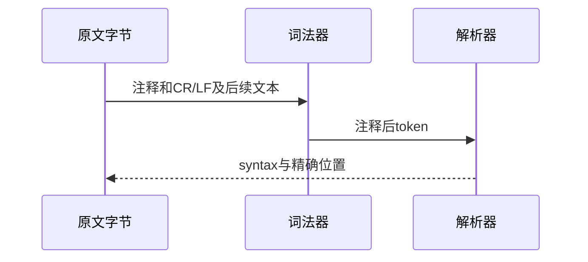

# Test262 注释结束后非法文本验证

## Intent：最终目标

阶段三百二十四：验证真实CR/LF结束单行注释，后续非法文本不被吞掉；完成行终止符目录剩余三文件。

## Data：可用证据

三个锁定原文包含问号串、this开头的自然语言、line comment两个相邻名称。S7.3_A3.2_T1描述CR但实际LF，按字节保留。已有单行CR/LF成功执行与跨行声明测试可作为合法终止控制。

## Edges：边界与限制

放入合法函数初始化表达式位置，保持原注释和非法文本。ZX包装决定具体诊断位置，不宣称与JavaScript错误文本相同；必须证明错误位于注释后文本。

## Answer：交付格式与成功标准

三个前端用例核对parse/syntax与具体span；原文哈希、参考解析拒绝、矩阵、生成器和前端专项通过。保留探针，确认实际诊断后登记。

## 自我复核

不删除非法文本，不将任意词法拒绝视为通过；诊断必须来自暴露后的具体token。本阶段不改变生产语法。

## 验证结果

独立CLI探针先确认诊断落在原注释后的问号串、text、comment；正式用例再核对完整span。运行 `zig build test-frontend --summary all`：5/5步骤、5265/5265测试通过。原文3个哈希和正文核验、6次参考解析拒绝通过。生成器重复性、矩阵、格式与diff检查通过。

JSONL64930，frontend5265；上游已审阅1886=657 adapted+103 equivalent+1126 excluded，未审阅51711，关联4792。行终止符目录无未分类文件，仍存在明确排除的语义。本次未改生产实现、未发现缺陷或发送实现消息、未重跑完整根回归。
