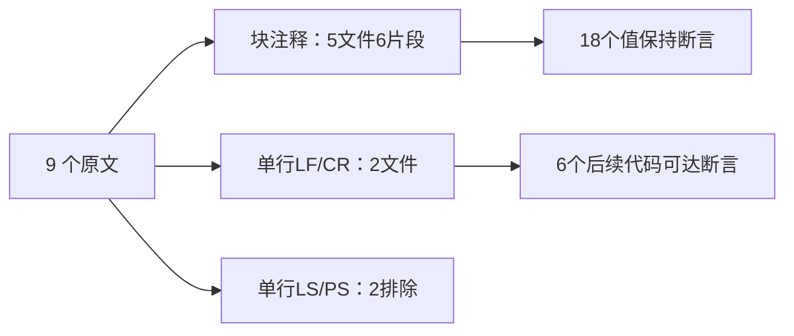
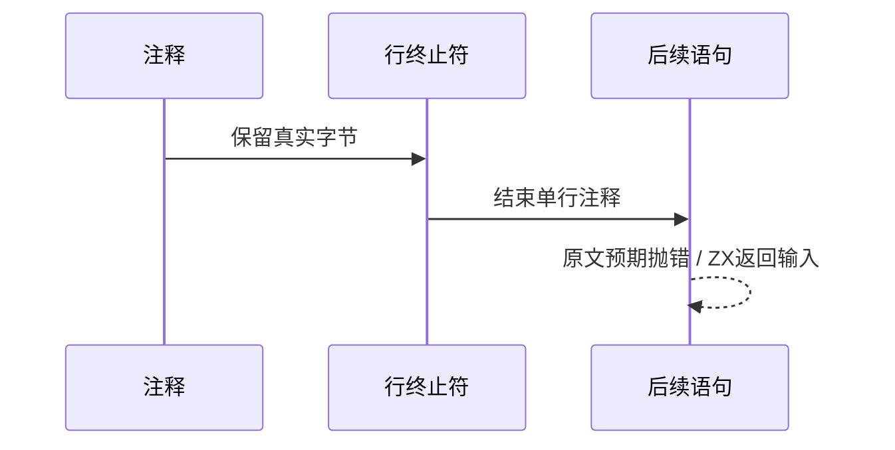

# Test262 注释行终止符执行验证

## Intent：最终目标

阶段三百二十一：覆盖块注释内换行与单行注释后的代码执行，正确处理上游 runtime-negative 的验收含义。

## Data：可用证据

选择9原文：4种块注释行终止符、PS块注释eval、4种单行注释终止符。上游多数通过实际抛出 Test262Error 证明预期分支被执行；仅编译成功或任意错误不足以证明通过。

## Edges：边界与限制

ZX支持块注释中的LF/CR/LS/PS和单行注释的LF/CR终止。单行LS/PS与当前ZX契约不同，明确排除。上游throw观察点改为返回输入值，只适配可执行性，不声称实现异常系统或eval。

## Answer：交付格式与成功标准

5块注释文件复用既有原注释生成器，2个单行终止文件独立生成紧邻终止字符的return，避免后加LF掩盖CR终止失败。新增24运行断言。原文runtime-negative必须按Test262Error精确验证，另有2文件excluded。

## 自我复核

块注释值保持与单行注释终止是两个不同性质。后者不能插入额外LF再证明CR有效；参考核验也不能把parse错误当预期运行错误。

## 验证结果

运行 `zig build test-comment-characters test-comment-terminators --summary all`：174/174 步骤、123/123 测试通过（117字符注释与6单行终止），本阶段新增24项。9原文完整哈希和源码核验通过，14次精确预期Test262Error、4次正常执行通过。原文先编译为Script，再检查运行错误类型，不能以SyntaxError冒充通过。

初次注册脚本用Python splitlines读取含真实LS/PS的JSONL，将字符串内部的字符误当记录边界；失败后矩阵阻止未注册目录。改为只按LF分记录，并用JSON转义存储数据，生成时仍恢复原字符。修正后生成器重复性、矩阵、格式和diff检查通过，没有改动编译器。

最新JSONL64911（runtime47427），上游已审阅1854=644 adapted+103 equivalent+1107 excluded，未审阅51743，关联4773。并行Store宿主正在按zero runtime修正，本阶段未依赖其尚未稳定的专用runtime路线。没有确定生产缺陷，未通知实现聊天，也未重跑完整根回归。
