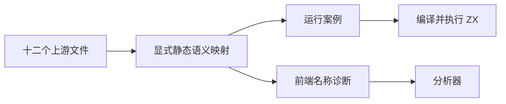
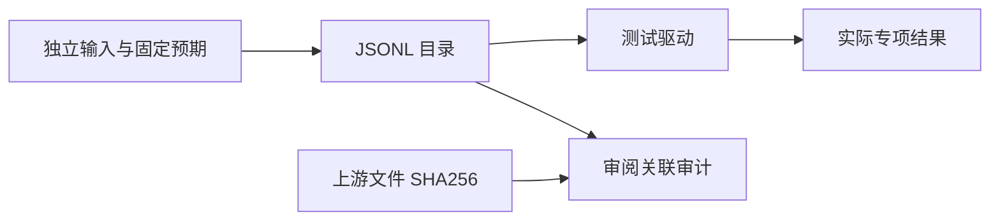

# Test262 相等名称解析验证

## IDEA

- Intent：对齐相等与不等表达式的取值、属性读取和未绑定名称边界。
- Data：固定 Test262 提交 `7ab7fafa0003f73fc85c1b95d88094d33f7eb8bd` 中 equals、does-not-equals、strict-equals、strict-does-not-equals 的 A2.1_T1—T3，共十二文件；当前关系名称测试与静态 ZX 契约。
- Edges：ZX 静态同型数值使用 ==/!=；本组上游严格与非严格相等在同型数值上共享行为证据，不宣称 JS 隐式转换。var/new Object/后续属性赋值改为 const/静态对象初始化，未绑定名称改为分析期 name 诊断，不伪造运行期 ReferenceError。
- Answer：五种读取形态的真实执行、未绑定精确 span 与已绑定对照、十二条带 SHA256 的审阅记录、相关专项结果。相同用例被多条审阅关联只计数一次。

## 执行计划

1. 逐文件核查上游断言并保存语义映射。
2. 草稿编写两操作符的字面量、左右绑定、双绑定与属性读取案例；增加不等与零输入以发现常量结果错误。
3. 登记前端和运行案例，执行对应专项；审计映射、生成一致性与类型检查。

## 架构

## 数据流

## 执行结果

新增 36 个登记案例：26 个运行案例、10 个前端案例。十二条上游记录均为 adapted，保存固定快照原文件 SHA256，并关联实际断言/诊断及 span。严格和非严格文件共享同型数值证据，没有重复计数运行案例。

`zig build test-runtime test-frontend --summary all` 退出 0：912/912 步骤、45,871/45,871 测试通过，日志 `/tmp/zxc-equality-names.log`。TypeScript、生成一致性、审阅审计、Zig 格式、diff 与草稿一致性检查通过。无生产源码修改，没有发现需通知实现会话的新缺陷。

登记累计 57,781：runtime 42,668、frontend 3,203、evaluation_order 764、safety 464、RX 图 10,446、Store 236。上游已审阅 340/53,597（205 adapted、102 equivalent、33 excluded），未审阅 53,257，唯一关联案例 1,453。最近完整根回归仍为阶段 90；本轮专项结果不能替代完整根结果。

## 自我批判

- 上游五种取值形态逐项映射，但动态对象分配与写入不是本轮执行内容；所有记录使用 adapted 而非全语言兼容声明。
- 数值有限输入的宿主比较给出独立预期，不覆盖 NaN、无穷和所有位模式；这些边界须依赖对应浮点测试，不能外推本轮结果。
- 双未绑定案例证明当前诊断首先定位左侧，不证明运行时操作数调用顺序；调用顺序需要独立轨迹入口。
- 本轮共享上游相等/严格相等的同型证据合理，但不代表混型抽象相等已实现。整体 Test262 对齐和生产级目标仍未完成。
