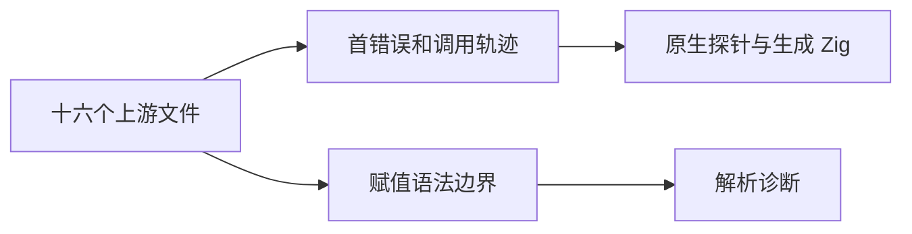
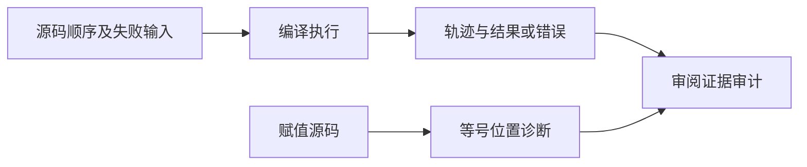

# Test262 相等求值顺序验证

## IDEA

- Intent：核查相等表达式左右求值与首个错误传播，并固定 ZX 不支持赋值表达式和隐式全局的边界。
- Data：固定 Test262 快照四种相等操作的 A2.4_T1—T4 共十六文件；已有 comparison 调用轨迹中 equal/not_equal 的 144 条执行案例；当前逻辑赋值表达式拒绝测试风格。
- Edges：调用轨迹由 fallible native 函数观测，替代 JS throw；赋值表达式是解析期拒绝，不把拒绝当成上游赋值运行语义实现。四种上游操作适配到 ZX 同型 ==/!=，共享证据不重复计数。
- Answer：八个新增解析诊断案例、复核已有轨迹、十六条带 SHA256 的审阅记录与专项结果。

## 执行计划

1. 逐文件核查两个赋值位置、未绑定后赋值、隐式全局和双错误行为。
2. 新增八个解析拒绝，精确定位赋值等号。
3. 复用已有 144 条相等调用轨迹并执行专项，审计十六条关联。

## 架构

## 数据流

## 执行结果

新增八个前端解析案例，复用既有 144 条 equal/not_equal 调用轨迹，新增十六条 adapted 审阅记录。T2 的双失败要求首错误传播且不执行第二侧，轨迹与错误分别断言；其余文件保留赋值位置并明确静态解析拒绝。

`zig build test-frontend test-evaluation-order --summary all` 退出 0，34/34 步骤、3,976/3,976 测试通过，日志 `/tmp/zxc-equality-order.log`。TypeScript、生成一致性、审计、格式、diff 和草稿一致性通过。无生产源码修改或新缺陷。

目录累计 57,789：frontend 3,211，其余计数不变。上游 356/53,597（221 adapted、102 equivalent、33 excluded），未审阅 53,241，唯一关联 1,605。最近完整根回归仍是阶段 90。

## 自我批判

- 复用调用轨迹的前提是核查了探针、生成程序及断言实现，并实际重跑专项；单有关联记录不等于执行证据。
- 赋值拒绝是已选择静态语言的设计边界，不是上游运行行为通过，因此记录为 adapted 并明确差异。
- 既有 144 条轨迹使用有限数值，不验证 JS valueOf/ToPrimitive 或动态异常对象。
- 本轮未处理 A1 空白字符源码边界；四份相关文件虽然已阅读，仍保留未审阅状态，等待可执行证据。
