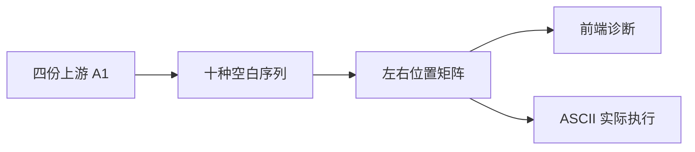
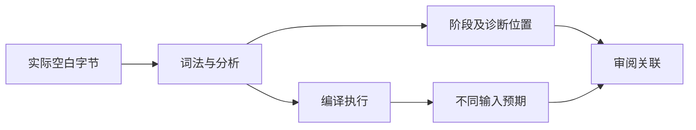

# Test262 相等空白字符验证

## IDEA

- Intent：对齐相等运算符两侧的空白字符处理，并区分词法边界与混型比较拒绝。
- Data：固定 Test262 四份相等 A1 文件，每份九字符加一组合；ZX IR 契约明确 ASCII 空白；成熟 comments 测试给出字节位置模式。
- Edges：上游 eval 改为真实静态源码；===/!== 的同型比较映射到 ==/!=。bool 与数值不隐式转换；NBSP、LS、PS 不接受。新增左侧、右侧、双侧分别验证，防止第一侧词法错误掩盖另一侧。
- Answer：前端诊断及精确词法 span、接受字符的实际执行与不同输入对照、四条上游映射和专项结果。

## 执行计划

1. 生成十种空白序列与三种位置、两种操作、两种操作数类型的前端矩阵。
2. 为六种 ASCII 字符逐位置编译执行，输入 1 和 2 检查相等及不等结果。
3. 核查四份上游映射，执行前端与运行专项并更新记录。

## 架构

## 数据流

## 执行结果

新增 192 个案例：十种空白 × 三种位置 × 两操作 × 两类型 = 120 个前端案例；六种 ASCII × 三种位置 × 两操作 × 两输入 = 72 个运行案例。非 ASCII 按原始 UTF-8 首字节定位，混型 ASCII 比较为分析期 type_mismatch，同型对照必须接受且实际执行正确。

`zig build test-frontend test-runtime --summary all` 退出 0：920/920 步骤、46,071/46,071 测试通过，日志 `/tmp/zxc-equality-whitespace.log`。类型、生成一致性、审计、格式、diff、草稿一致性通过。无生产源码修改，没有新缺陷通知。

登记 57,981：runtime 42,740、frontend 3,331、evaluation_order 764、safety 464、RX 图 10,446、Store 236。上游 360/53,597（225 adapted、102 equivalent、33 excluded），未审阅 53,237，唯一关联 1,797。最近完整根回归阶段 90，本轮仅相关专项。

## 自我批判

- 先拒绝非 ASCII 意味着这些案例没有进入类型分析；只有 ASCII 混型案例能证明对应 type_mismatch。
- eval 已替换为静态源文件；不能以本轮结果声明动态执行能力。
- 严格与非严格上游文件共享同型数值运行证据，审阅条目不增加实际测试数。
- 只验证九种上游字符及其组合，不外推所有 Unicode 字符。ASCII-only 是显式 ZX 契约，与 ECMAScript 的差异保留在 adapted 记录中。
- 整体 Test262 对齐和生产级语言目标尚未完成。
