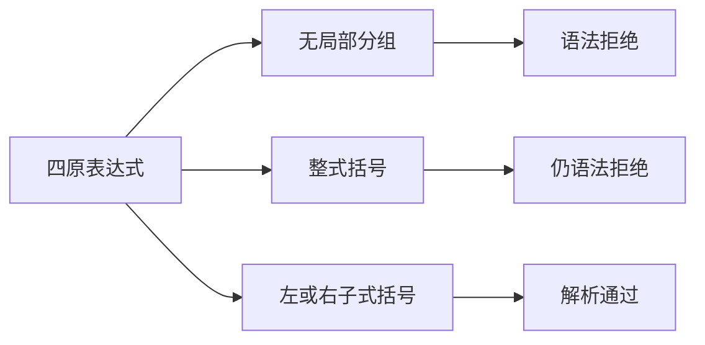
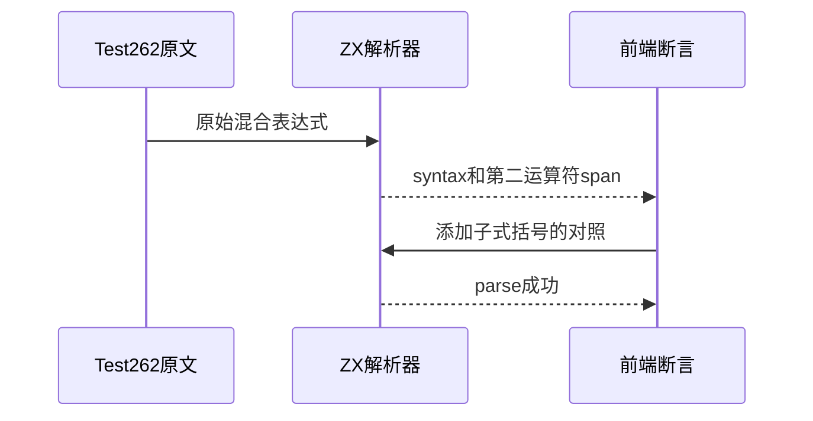

# Test262空值合并混用语法

## Intent：最终目标

阶段258：补齐coalesce剩余四份混用早期错误用例，区分解析拒绝与后续类型拒绝。

## Data：可用证据

四原文分别将&&/||置于??前后，均标记parse SyntaxError。当前parser_expressions按BinaryFamily拒绝无括号混合。已有coalesce_logical运行覆盖显式分组，但没有这四原文登记。

## Edges：边界与限制

完整保留0/true操作数及运算符顺序，只加入ZX函数壳；不转换为bool参数回避原文。正例仅证明加括号后可解析，类型分析不在此组，不能声称JS隐式转换兼容。

## Answer：交付与成功标准

16项前端：四原文直接及整式括号8负例，分别给两侧子式加括号8正例。负例parse阶段syntax及第二混合运算符的字节span准确；JS参考同样拒绝8负例且接受8正例。上游四原文严格/非严格仅编译不执行。

## 实际结果

新增16项前端测试，5/5步骤、16/16通过。八负例准确报parse/syntax及第二混合运算符字节span；八子式括号正例parse成功，不进入类型分析。四原始文件内容哈希及表达式一致，strict/sloppy共八次SyntaxError已由JS Script构造验证，没有执行DONOTEVALUATE。

实际ZX表达式的八负例与八正例均经JS独立解析对照一致。扫描coalesce目录24文件，与审阅路径集合完全相同，全部24哈希一致；17适配（含部分适配）、7排除，0未审阅。生成器--check、TypeScript类型、目录审计和构建格式检查通过。

当前64,187案例（运行46,827、前端5,130、轨迹1,084、隔离464、模块10,446、Store236）；上游1,060/53,597（572适配、103等价、385排除），未审阅52,537，关联4,236。

## 自我批判

ZX布尔运算不接受原文数字操作数，但本轮只检验早期语法规则，前端测试明确停在parse，避免把类型拒绝当SyntaxError。加子式括号后只是可解析，不声称类型分析或运行值可直接对齐。整式括号负例是边界补充，不计为额外上游文件。

没有生产源码改动、全仓回归或浏览器验证，无新缺陷。目录审阅收口不等同于全部24用例完整通过。
