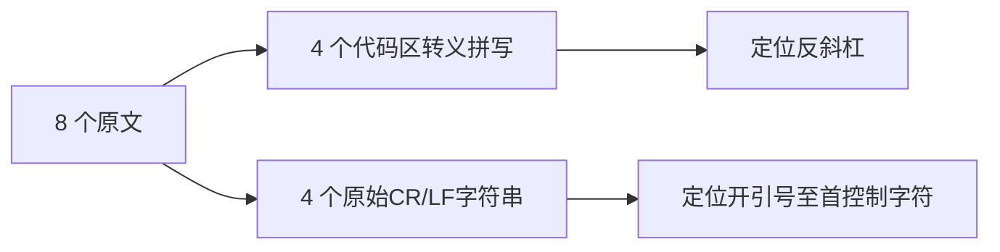
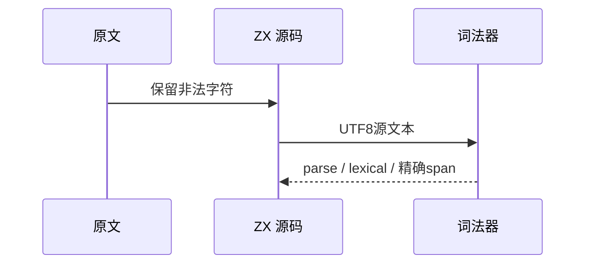

# Test262 行终止符词法负例验证

## Intent：最终目标

阶段三百二十二：补足转义拼写不能替代代码区换行，以及字符串内未转义CR/LF的词法拒绝。

## Data：可用证据

读取8个锁定原文与源码字节。4个A6文件使用反斜杠Unicode拼写；4个字符串负例含真实LF或CR。其中S7.3_A2.2_T2描述声称CR，实际与A2.1_T2一样包含LF，以字节为准。

## Edges：边界与限制

var改const并增加合法初始化，非法拼写不变；两个原单引号字符串仅转换定界符，内部CR/LF不变。验证具体lexical和范围，不以任意拒绝代替。原文重复LF不宣传为两个不同的行终止符。

## Answer：交付格式与成功标准

沿用whitespace_rejections生成4个代码区拒绝，新增string_terminators生成4个字符串拒绝，共8前端用例。原文哈希与parse-only参考核验、生成器重复性、矩阵和前端专项通过。

## 自我复核

只新增本次未登记的上游文件；原始CR从bytes解码，避免文本读取归一化为LF。输入元数据和实际字节冲突保留到文档，不擅自修正上游源码。

## 验证结果

执行 `zig build test-frontend --summary all`：5/5步骤、5262/5262测试通过。本阶段新增8项，原文8个哈希及正文核验、16次参考仅解析拒绝通过。两生成器重复性、矩阵、格式和diff检查通过。

JSONL64919，frontend5262；上游已审阅1862=652 adapted+103 equivalent+1107 excluded，未审阅51735，关联4781。没有生产实现变更或确定缺陷，未发实现消息；未重跑完整根回归。
