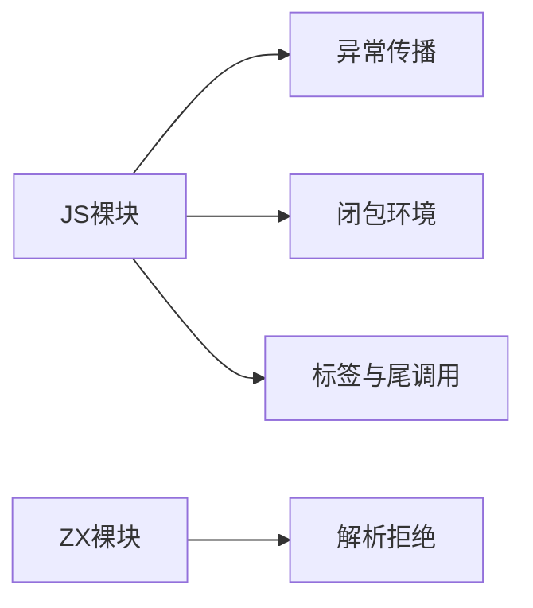
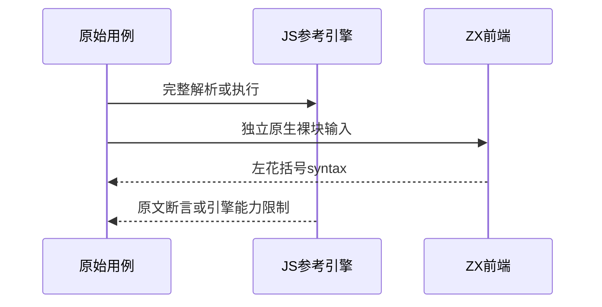

# Test262裸块语义与支持边界

## Intent：最终目标

完成block剩余十份用例审阅，验证ZX不支持独立裸块语句的明确边界，不以if分支块替代块语句的异常、作用域或递归行为。

## Data：可用证据

剩余原文包括两个表达式内块语法负例、两个异常传播用例、三个闭包作用域用例、一个continue标签负例和两个尾调用用例。ZX Statement语法没有独立BlockStatement、throw/try/循环标签或递归契约。

## Edges：边界与限制

四项ZX原生裸块拒绝测试只验证不支持的语法入口，不关联为原文通过。尾调用保持onlyStrict与100000深度；参考引擎栈溢出不算通过。异常参考执行需在同VM引入断言，不能跨上下文用instanceof误判异常。

## Answer：交付与成功标准

十份逐项excluded审阅、固定SHA与真实参考解析/执行；四个精确裸块左花括号诊断；递归索引核对block全部21份已审阅，仍保留语义不兼容边界。

## 实际结果

四项ZX原生裸块拒绝：空块、绑定块、返回块以及if内裸块，全部在目标左花括号给出parse syntax；5/5构建步骤4/4通过。它们不与上游excluded记录关联，不声称解析拒绝验证了上游作用域和异常语义。

十原文SHA与索引一致。三个语法负例各strict/sloppy解析失败符合预期，共六次；五个异常与作用域原文各strict/sloppy完整执行通过，共十次，保留手写异常守卫和同VM构造器检查。两个尾调用保持onlyStrict与辅助文件100000深度，均参考引擎RangeError栈溢出，未计通过。

生成器--check、类型、构建格式与本轮新增文件空白检查通过；三正式文件副本和审阅草稿字节一致。全局审计通过：63,919目录案例（前端5,044、运行46,661），已审阅990/53,597（539适配、103等价、348排除），未审阅52,607；关联4,166。

递归索引核对block共21份且全部已有审阅，3适配18排除。此处只证明审阅覆盖，不代表完整块语义兼容。

## 自我复核

异常构造器必须在同一VM上下文比较，避免宿主ReferenceError与原文ReferenceError身份不同造成假失败。裸块入口拒绝不会深入执行其中绑定、return或异常，不将四个前端负例描述为这些内部语义已覆盖。

本轮没有生产源码修改、完整仓库回归或浏览器操作。上游尾调用参考失败保留为能力限制，未缩短递归深度或改写原文预期。Context专项保持已删除。
