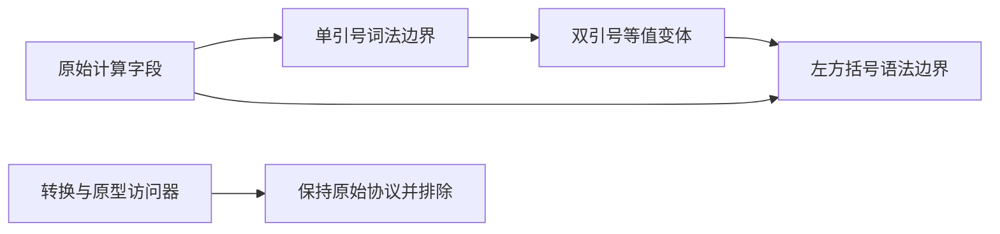
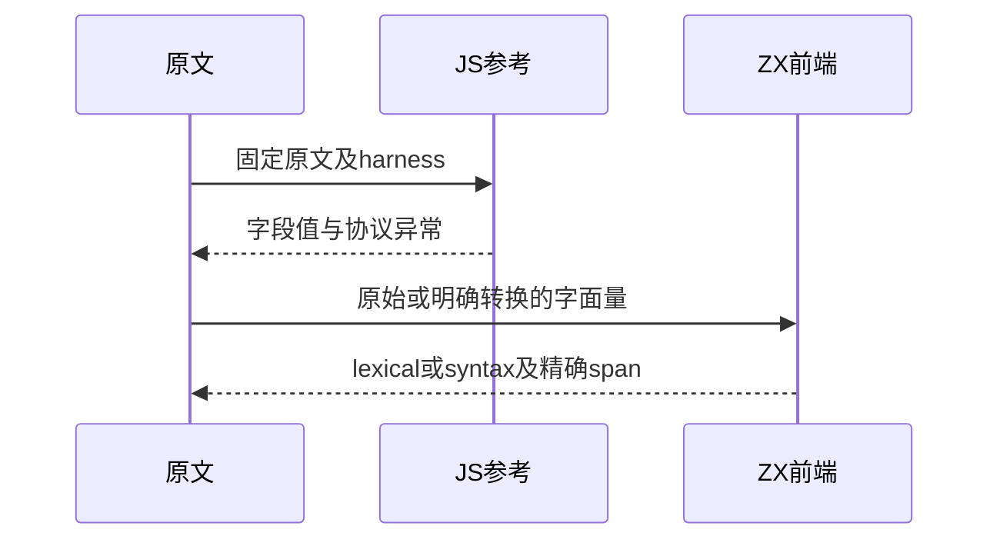

# Test262计算属性名与转换时序

## Intent：最终目标

核验对象计算属性名的边界，区分字段名称计算、ToPropertyKey、副作用顺序和访问器名称异常，保留上游实际表达式。

## Data：可用证据

完整读取14份原文。parser对象字段调用name，不支持[expr]名称；lex只接受双引号字符串，单引号在整段词法扫描时先报错。证据包含固定SHA256、完整body、实际对象字面量。

## Edges：边界与限制

原文单引号形式必须保留词法拒绝，双引号变体单列以定位计算名称的语法拒绝。复杂对象转换、访问器、原型和名称副作用不得换成普通字段成功案例。Context相关测试停止。

## Answer：交付与成功标准

七个原文字面量边界，两个字符串等值写法的补充边界；其余七份明确说明排除理由。真实原文在固定harness执行，观察异常构造器与断言；验证ZX诊断代码和字节位置。

## 实际结果

新增9条前端：7个原文构造表达式，其中2条因单引号先报lexical、5条在[处报syntax；2个双引号变体排除单引号干扰后同样在[处报syntax。每条检查精确字节span。14原文登记7适配、7排除。

`zig build test-frontend -Dfrontend-filter=language/types/object_computed --summary all`：5/5步骤9/9通过，日志 `/tmp/zxc-object-computed.log`。固定真实sta/assert执行14完整原文，观察40次sameValue及6次访问器异常（ReferenceError、Test262Error、TypeError各2），同时核对9个原始/变体表达式的字段结果。日志 `/tmp/zxc-object-computed-reference.log`。

生成器--check、TypeScript、覆盖审计、fmt及本轮范围diff通过，日志 `/tmp/zxc-object-computed-{check,typecheck,audit}.log`。目录63546（前端4866）；上游773/53597（474适配、103等价、196排除），剩余52824、关联3937。三份正式文件与草稿字节一致。

## 自我复核

identifier原文description误称string literal，分类根据实际[x]表达式；其值'2'的单引号同样会先触发词法错误，而不是等到字段名称解析。没有只看标题生成测试。

原文order断言键和值顺次为1/2、3/4、5/6；转换顺序原文用toString把value从bad改为ok。这两者均没有改写成此前普通字段LR调用测试。计算__proto__与普通__proto__的原型差异、访问器的名称求值和转换异常完整保留于参考审阅，明确不计ZX实现。

本轮全部新增都是边界测试，不能增加计算属性运行语义覆盖的结论。未修改生产源码，未执行Context或全量测试，未发现新的既定ZX契约违例。
