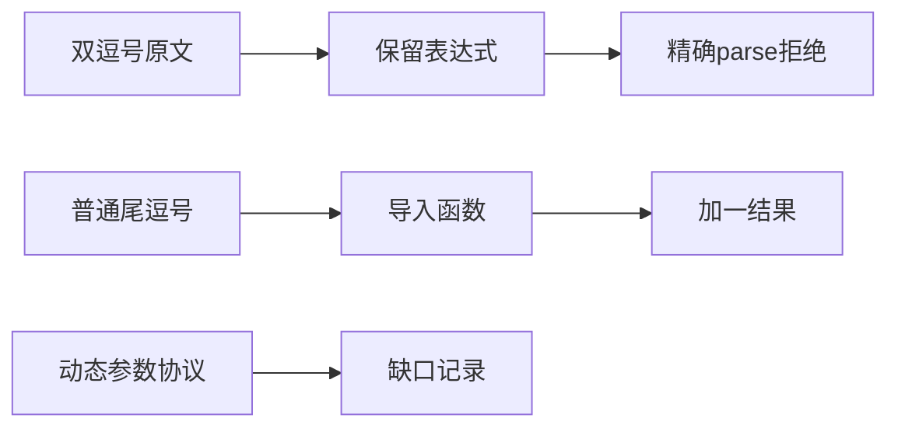
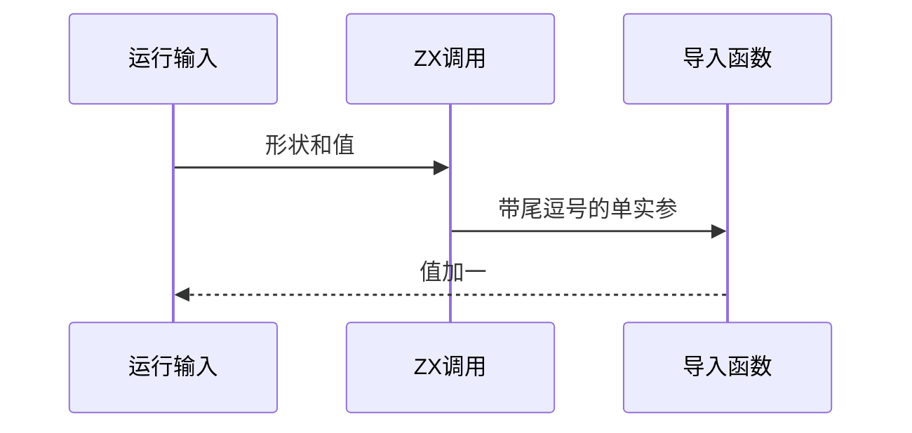

# Test262调用参数列表边界

## Intent：最终目标

阶段267：审阅9项Sputnik参数列表及1项spread尾逗号，验证调用参数语法与实际单输入尾逗号执行。

## Data：可用证据

十原文完整读取。双逗号原文仅要求parse/SyntaxError，可保留表达式适配；其他涉及arguments、动态参数赋值异常和spread，当前协议不同。

## Edges：边界与限制

语法正例不证明ZX多参数调用类型合法。原生运行使用导入单输入函数，不用普通尾逗号替代spread尾逗号的上游要求。参考原文遵守noStrict标记。

## Answer：交付与成功标准

1适配9差异，4非法及4合法参数列表解析，4尾逗号形状×2输入真实执行。原文SHA/模式验证、生成/类型/审计通过。

## 实际结果

17/17步骤16/16通过，8语法（4拒绝+4合法）与8真实导入调用。四种尾逗号形状涵盖直接、换行、逗号后注释及实参后注释，输入-7/9输出-6/10。构建追踪increment.zx依赖。上游原文10SHA及16运行+2parse参考通过，遵守两项noStrict；真实ZX主函数和helper体独立参考一致。

生成--check、类型、审计、格式及注册diff检查通过。当前64,280案例（前端5,189、运行46,861）；上游1,142（576适配、103等价、463排除），未审阅52,455；关联4,240。call目录22/92已审阅。

## 自我批判

首次生成因本轮脚本join字符串换行转义错误中止，紧接构建缺少生成文件失败；原日志保留。修复生成脚本后等待旧构建明确退出，再重跑通过，未将测试构建错误归咎编译器。

唯一适配只链接保留原表达式的精确parse断言；合法多参数对照仅解析，不声称通过类型检查。普通尾逗号运行不覆盖空spread，也不覆盖arguments反射或动态参数赋值顺序。没有生产改动、全仓回归或UI检查。
