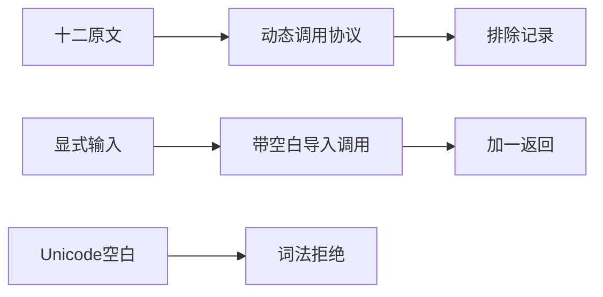
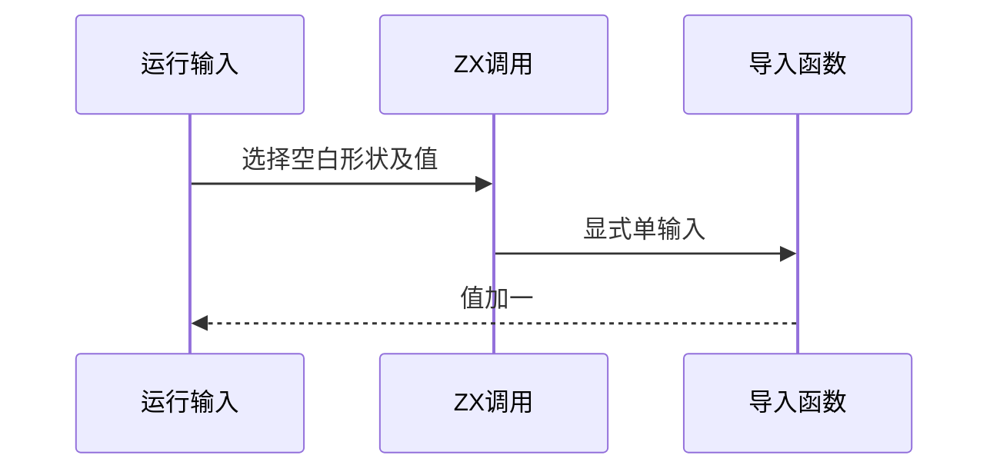

# Test262调用基础协议与空白

## Intent：最终目标

阶段262：审阅call目录Sputnik基础十二文件，验证静态调用词法边界且不冒充动态调用异常协议。

## Data：可用证据

完整读取A1/A2、A3_T1至T5、A4_T1至T5；涵盖Number eval、未声明调用、原始值与包装/全局对象的非可调用错误。

## Edges：边界与限制

十二原文排除。新增原生调用测试使用显式输入导入函数，六ASCII空白×两个运行输入；Unicode空白拒绝仅记录ZX边界。上游运行TypeError不由静态name/type错误替代。

## Answer：交付与成功标准

12实际调用结果等于输入加一，四Unicode空白精确词法错误；12原文哈希和完整双模式执行通过，生成/类型/审计通过。执行记录续第三册。

## 实际结果

新增16项：六种ASCII空白的真实导入调用×输入-7/9，输出分别-6/10，共12项；四Unicode空白parse/lexical精确拒绝。构建17/17步骤、16/16通过，构建注册声明increment.zx依赖，辅助函数变化不会漏过缓存追踪。

十二原文哈希与完整双模式24次执行通过，12实际ZX调用与辅助函数体独立参考一致；4Unicode调用表达式在JS语法合法，不执行其中未声明callee。生成--check、类型、目录审计、格式及注册diff检查通过。

当前64,223案例（运行46,853、前端5,140、轨迹1,084、隔离464、模块10,446、Store236）；上游1,093/53,597（575适配、103等价、415排除），未审阅52,504，关联4,239。call目录12/92已审阅，全部为本批明确协议差异，不增加上游通过数。

## 自我批判

真实调用空白测试证明ZX静态导入函数语法，不能证明Number无参转换或运行异常协议。负例在parse阶段终止，未声明missing名称不会遮蔽lexical预期。原文源码保留完整，不通过替换catch类型制造兼容。

执行记录第三册从阶段262起继续，第二册保留历史并增加续写指引。没有生产改动、全仓回归或UI验证，无新缺陷。
