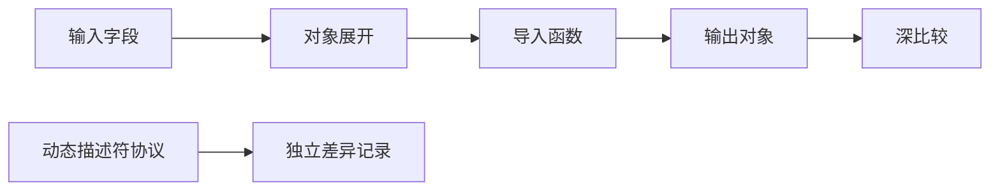
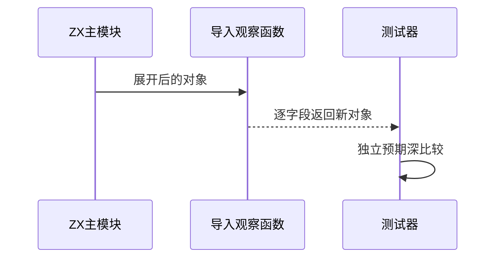

# Test262调用对象展开值验证

## Intent：最终目标

阶段268：核对13个调用对象展开原文，真实验证数据字段经展开后跨模块传参的值。

## Data：可用证据

13原文全部完整读取；其中多对象合并和展开覆盖已有字段可做字段值子集适配。沿用成熟对象构造与导入调用测试结构。

## Edges：边界与限制

两项仅部分适配，不覆盖Object.keys、匿名函数callCount或源对象再次读取。其余11项动态描述符/getter/Symbol/空值展开/身份协议保留差异。不能以编译成功证明调用结果。

## Answer：交付与成功标准

两个模块场景各3组输入，含原值及不同/相同/负值，真正导入函数返回所有字段，深比较完整对象。13原文SHA及双模式完整参考通过，生成/类型/审计通过。

## 实际结果

17/17构建步骤、6/6运行案例通过。合并结果{a,b,c,d}及覆盖结果{a,b}完整深比较，包含原文输入、不同负值及与覆盖字面量相同的输入。两个observe.zx均作为构建依赖追踪。

13原文SHA与26完整strict/sloppy执行通过，使用原生propertyHelper/compareArray等includes；6个实际ZX主函数与导入函数体独立JS参考一致。生成--check、类型、目录审计与格式检查通过。总目录64,286（运行46,867、前端5,189）；上游1,155（578适配、103等价、474排除），未审阅52,442，关联4,242。call目录35/92审阅。

## 自我批判

适配是字段值子集，不能宣称原文件所有断言通过。对象返回能观察到全部目标字段，不借助加权和掩盖字段交换，但不能证明函数只调用一次。生成器首次因字符串换行转义问题失败，修正后生成检查、类型和实际构建通过；不是编译器缺陷。未修改生产源码，没有全仓或UI验证。
