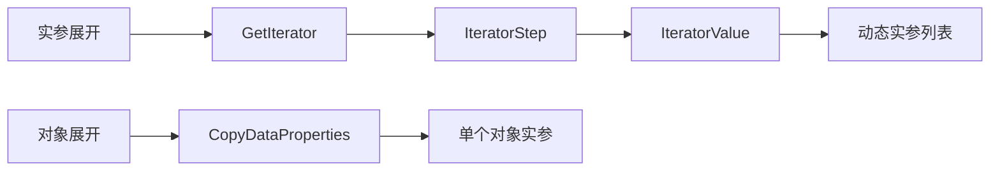
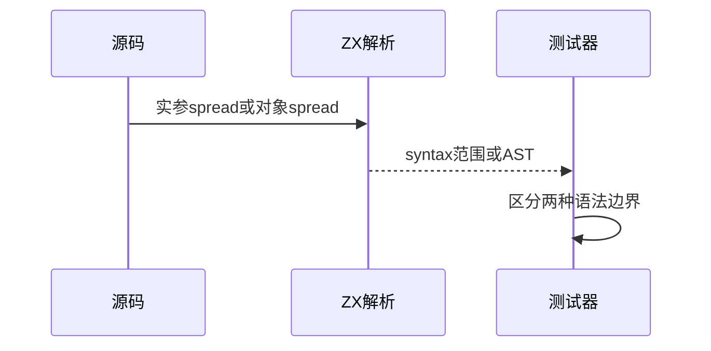

# Test262调用展开迭代协议审阅

## Intent：最终目标

阶段269：审阅余下28个spread调用文件，区分实参迭代展开与对象字段展开。

## Data：可用证据

完整读取28原文：22实参迭代场景及6对象展开场景；ZX参数列表parser逐项读取普通表达式，不接受实参spread。对象spread在对象primary内单独处理。

## Edges：边界与限制

全部28当前协议差异。不能通过把spread改成一个列表参数或把运行异常改成静态错误适配。mult-err-iter-get-value原文注释与源码不完全一致：getter返回null而非方法返回null，以源码为准记录。

## Answer：交付与成功标准

28SHA及56完整双模式参考；4实参spread精确拒绝与2对象spread解析对照，检查边界而不充当兼容。生成、类型与审计通过。

## 实际结果

28个原文SHA和56次完整严格/非严格执行通过，使用原生断言及propertyHelper。6原生表达式均为JS合法语法，4个ZX调用spread在完整三字节省略号处报parse/syntax，2个对象spread解析成功；5/5步骤6/6通过。

生成--check、类型、目录审计、格式通过；总目录64,292（运行46,867、前端5,195）；上游1,183（578适配、103等价、502排除），未审阅52,414，关联4,242。call目录63/92，剩余29。能力缺口已同步实现会话。

## 自我批判

文件名spread不能直接决定语义：本批6文件实际是对象展开，不能混为实参迭代。原文元数据也可能与源码不完全一致，必须核对实际触发路径。6原生案例仅验证parse边界，不替代运行异常、迭代顺序或描述符。未为同一拒绝生成28重复案例，没有生产修改、全仓回归或UI检查。
