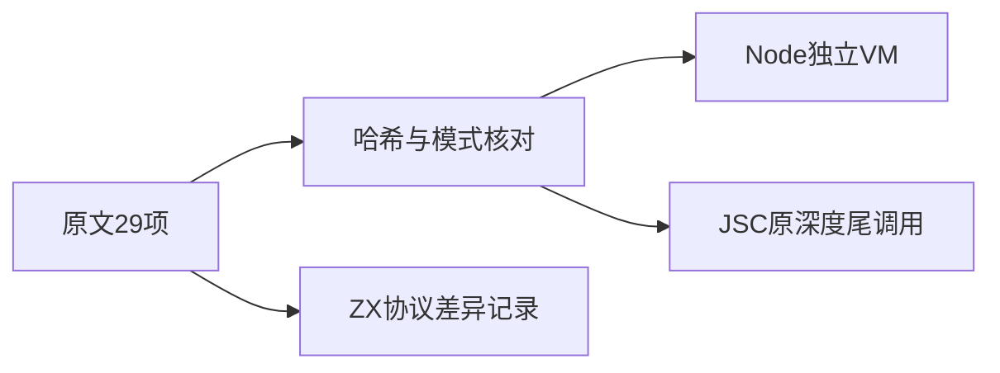
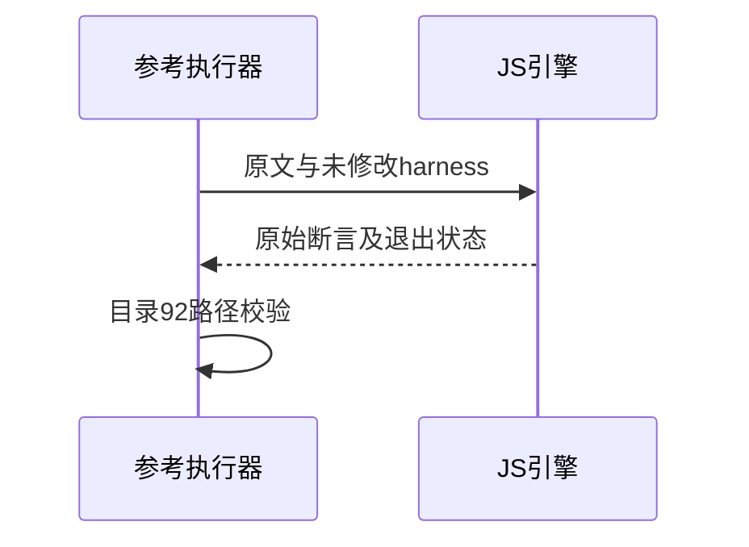

# Test262调用目录审阅收口

## Intent：最终目标

阶段270：完成call剩余29原文审阅并验证参考执行，结束该目录的逐项分类。

## Data：可用证据

完整阅读8动态目标校验顺序、10eval、4环境、6尾调用与1with原文。ZX IR契约要求函数按依赖拓扑排列，禁止递归。系统JavaScriptCore jsc可用，直接运行原深度尾调用；其他文件用Node独立VM及真实跨realm环境。

## Edges：边界与限制

全部29存在当前协议差异；不降低tcoHelper的100000深度，不替换递归或忽略栈溢出。没有新的ZX语义分支可验证，不重复添加已有静态拒绝测试凑数。

## Answer：交付与成功标准

29原文和辅助harness哈希、原始模式执行、call目录92路径无重无漏；生成/类型/审计通过，报告实际参考引擎结果。

## 实际结果

call目录92/92路径无重无漏、全部哈希核验，3子集适配89当前排除。剩余29项参考尝试47次：33次Node和10次JavaScriptCore通过，4项同名eval尾调用在JSC原始100000递归深度触发RangeError，未计通过。两项普通尾调用同深度JSC通过。harness及JSC可执行文件SHA均记录在日志中。

Node执行eval-spread.js原文时局部变量仍为local而非预期1；切换JSC执行四个eval-spread原文，两模式8次通过。保留Node失败日志和JSC初次尾调用失败日志，不改原文、不替换eval、不缩小递归深度。跨realm通过Node真实独立VM创建全局对象及eval函数，不伪造返回值。

生成--check、TypeScript、目录审计、Zig格式及本次diff检查通过。目录案例64,292保持不变；上游1,212（578适配、103等价、531排除），未审阅52,385，关联4,242。当前登记只表示审阅进度，参考限制不写成已通过。

## 自我批判

参考引擎本身也会不符合上游断言，不能把引擎栈溢出归咎ZX，更不能调低100000深度制造通过。四个尾调用参考限制仍未解决；ZX排除结论独立依据其IR明确禁止递归，不依赖参考是否成功。本轮没有新增可独立观察的ZX语义分支，因此不复制静态拒绝案例增加数量。没有正式生产源码修改、全仓回归或UI验证。
