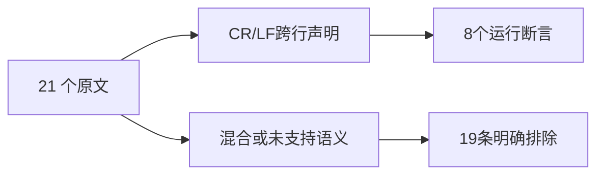
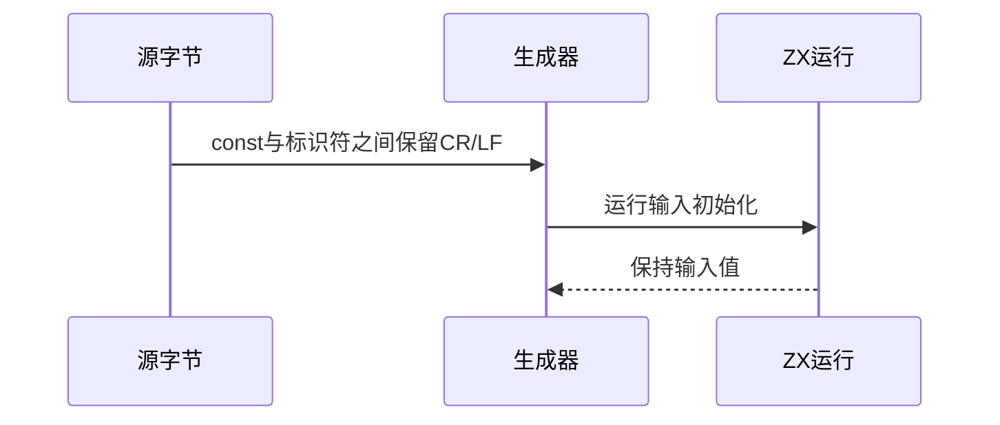

# Test262 跨行词法边界验证

## Intent：最终目标

阶段三百二十三：保留真实CR/LF跨行声明执行，审阅混合Unicode行终止符与正则/字符串语义文件。

## Data：可用证据

重新计算剩余24原文并完整读取正文。本阶段处理其中21项：2个CR/LF跨行声明支持；19个文件包含不支持的LS/PS代码空白、Unicode字符串转义与索引长度、正则字面量或LS/PS单行注释终止规则。

## Edges：边界与限制

A7系列每文件混合LF与LS/PS断言，不能只取前半部分作为全文件适配。3个CR/LF单行注释后的非法文本用例留待下一阶段精确诊断，不在本阶段草率分类。读取bytes解码保留CR，不能用自动换行转换的读取方式。

## Answer：交付格式与成功标准

2个adapted各4输入，新增8运行断言；19excluded。原文哈希、参考核验、生成器重复性、矩阵和位置专项通过。

## 自我复核

只替换var为const、初值为输入并去掉分号，保留原换行位置。原值1仍在输入中，另含0、42与u64最大值。排除混合文件不意味着其中所有子行为都不支持。

## 验证结果

执行 `zig build test-whitespace-positions --summary all`：53/53步骤、29/29测试通过，其中本阶段新增8。21原文哈希和正文核验通过，参考30次执行、12次解析拒绝通过。生成器重复性、矩阵和本次diff检查通过。

JSONL64927（runtime47435），上游已审阅1883=654 adapted+103 equivalent+1126 excluded，未审阅51714，关联4789。行终止符目录尚余3个CR/LF单行注释非法文本文件。没有生产变更或实现缺陷，未通知实现聊天，未重跑完整根回归。
