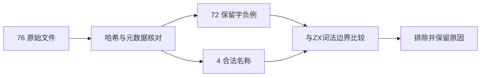
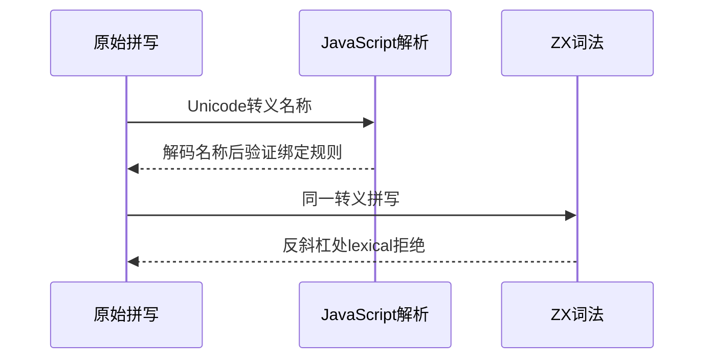

# Test262 转义标识符边界审阅

## Intent：最终目标

阶段三百二十八：核对两种 Unicode 转义形式的绑定名称，防止把 ZX 对反斜杠的统一拒绝误记为保留字规则已对齐。

## Data：可用证据

76 个原文包含 72 个保留字负例与 4 个美元、下划线合法绑定。逐项保存锁定版本 SHA256、正文、原始拼写和解码后的名称。词法实现 `packages/compiler/src/zx/frontend/lex.zig` 第42–47行直接扫描ASCII字节，第106–107行拒绝反斜杠；没有标识符Unicode解码步骤。

## Edges：边界与限制

JS解析阶段的保留字限制与ZX不支持转义标识符不是同一规则。全部逐项排除，不增加虚假的适配测试数量，不扩张生产语言设计。参考验证先确认两种转义合法名称的能力，再核对原文；所有原文无特殊flags/includes，负例只解析，不执行DONOTEVALUATE。

## Answer：交付格式与成功标准

原文证据、可重跑参考脚本、CLI边界探针及结果放在转义标识符边界草稿。76项参考核验和矩阵审计通过后写入独立review目录文件。无生产代码修改。

## 自我复核

排除仅代表当前ZX边界，不代表测试无价值或未来无需实现。逐项保留解码后名称，避免只依据文件名分类；合法转义能力控制可防止参考引擎缺功能而造成负例假通过。本轮未发现违反现有ZX契约的实现缺陷。

## 验证结果

76原文SHA与正文一致；参考两种合法转义能力检查通过，144次parse-only拒绝和8次正常执行通过。当前CLI重新构建17/17步骤成功，76个ZX探针全部在第一个反斜杠位置报lexical，精确行列匹配。矩阵审计通过。

JSONL仍65074，未新增正式案例；上游已审阅2034=678 adapted+103 equivalent+1253 excluded，未审阅51563，关联4916。未重跑完整根回归，不能将矩阵审计视为运行通过。没有修改生产源码，也没有向实现聊天发送无缺陷通知。
