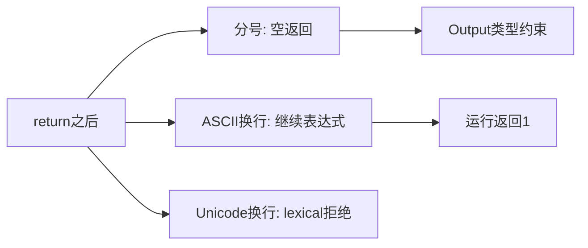
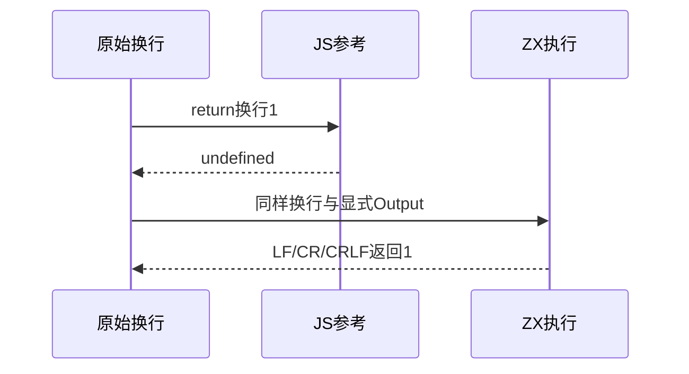

# Test262返回语句与换行边界

> 语法迁移记录：无分号迁移曾临时把return换行视为空返回，随后该判断已移除。阶段224实际复验LF/CR/CRLF仍返回1；旧前端分号语料尚待迁移，详见《无分号测试迁移复核》。

## Intent：最终目标

核验return后换行、空返回及不可达语句，明确ZX不采用JavaScript自动分号插入。

## Data：可用证据

完整读取五份固定原文。ZX lexer忽略ASCII换行，return解析显式分号或表达式；分析器对Output类型及不可达语句检查。

## Edges：边界与限制

JS return换行1得到undefined；ZX LF/CR/CRLF按同一表达式返回1，作为语义差异登记。Unicode行分隔符不被词法接受。void不是JS undefined值，空返回只验证ZX类型契约。Context注入及其测试已移除。

## Answer：交付与成功标准

三条换行运行结果、空返回类型与不可达语句前端检查。完整原文独立执行，保留差异，不把闭包及Math导数例子改写为常量。

## 实际结果

新增16项：3条LF/CR/CRLF实际返回1；13前端包括4种分号前换行分别在void成功/u64空返回失败的8项，3项不可达拒绝和2项Unicode词法拒绝。

`zig build test-return-statements test-frontend -Dfrontend-filter=language/statements/return --summary all`：25/25步骤16/16通过，日志 `/tmp/zxc-return-statement.log`。固定真实harness执行五份完整原文通过；独立JS核验三个ASCII换行均返回undefined，保留与ZX运行1的差异，而非宣称同值。空返回及Unicode换行参考对照通过，日志 `/tmp/zxc-return-statement-reference.log`。

生成器--check、类型检查、覆盖审计、fmt和本轮diff通过。九份正式文件与草稿字节一致。目录63797（前端4986、普通运行46633）；上游847/53597（525适配103等价219排除），剩余52750、关联4145。

## 自我复核

原文12.9-1的循环累加结果15没有改写成普通return常量；仅适配return与分号间的换行。A5原文在运行时跳过不可达代码，ZX则在静态阶段拒绝；只保留结构边界，不宣称任意可变语句已支持。A4闭包导数原文可在JS通过，但整体排除其高阶能力。

CRLF是ZX补充，原文列LF/CR/U+2028/U+2029；未伪称每个变体都来自上游。Unicode诊断span覆盖词法器报告的第一个UTF-8字节，未把字符索引误当字节索引。未修改生产实现或运行完整入口，Context注入测试保持已删除状态。
