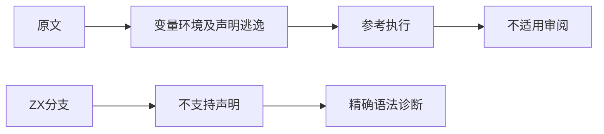
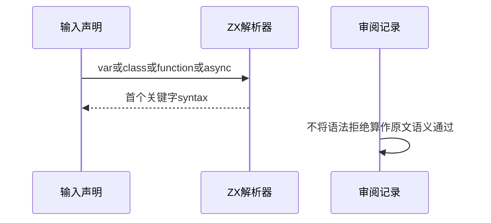

# Test262选择声明种类边界

## Intent：最终目标

核对switch中var、class、generator与async声明的语义，并验证ZX在对应分支入口明确拒绝不支持的声明。

## Data：可用证据

完整读取scope-var-none-case/dflt及scope-lex-class/generator/async-function/async-generator。两个var用例依赖非严格eval创建变量与闭包共享变量环境；四个声明负例在switch外引用名称时才触发ReferenceError。

## Edges：边界与限制

ZX只支持受限不可变声明，不具备上述eval变量环境及局部class/function语义。语法拒绝不能冒充原文runtime ReferenceError或变量共享验证。六份原文记录excluded，新增六项只算ZX原生声明边界测试。

## Answer：交付与成功标准

完整原文SHA与参考执行、六项精确parse syntax诊断、生成一致性与类型检查。保存明确区分的原文审阅与本地语法测试。

## 实际结果

六项原生ZX语法拒绝测试通过：5/5构建步骤、6/6用例。分别检查var、class、function、async起始关键字的parse syntax位置。不同function/async后缀目前在相同入口被拒绝，不能声称解析器深入验证了生成器或异步函数的内部结构。

六份原文SHA与索引一致；两份非严格var/eval原文完整运行5+4项断言通过，另四份完整原文得到预期ReferenceError。未改写原文，也没有将本地语法拒绝关联为上游语义通过。审阅全部excluded、cases为空。

生成器--check、类型检查、构建格式、本轮新增文件空白检查通过。三个正式副本逐字一致，审阅草稿与正式记录一致，上游路径无重复。

## 全局审计恢复

本轮audit_matrix退出0：63,900目录案例（前端5,029、普通运行46,657、调用轨迹1,068、隔离464、模块10,446、Store236）。上游已审阅881/53,597：536适配、103等价、242排除，未审阅52,716；关联本地案例4,161。此前旧加法诊断位置不一致在此次审计已消失，已通知实现会话。

这是目录与审阅一致性结果，不证明63,900项全量执行通过；本轮实际只跑了上述六项ZX专项及完整原文参考执行。

## 自我复核

四个ReferenceError原文的目标是有效声明的作用域，而ZX测试停在不支持的声明关键字，二者属于不同阶段与能力。两个var原文不能用const改写保持变量环境语义。保留当前设计边界不代表完成Test262全量对齐，仍有大量未审阅内容。

本轮未修改生产源码或历史迁移生成器；未运行浏览器或全仓库回归，Context专项保持已删除。
