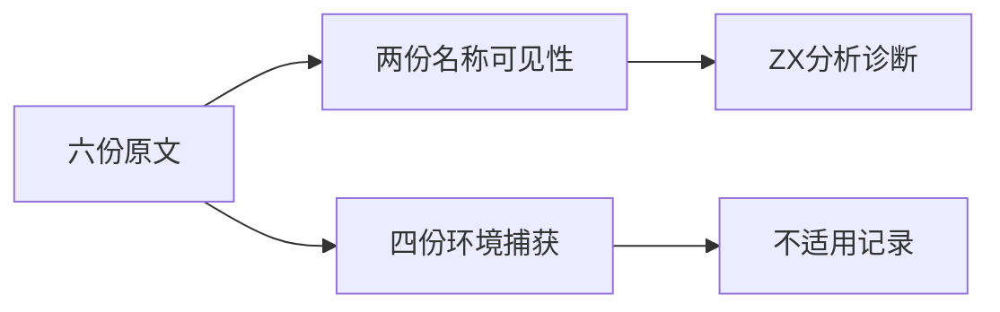
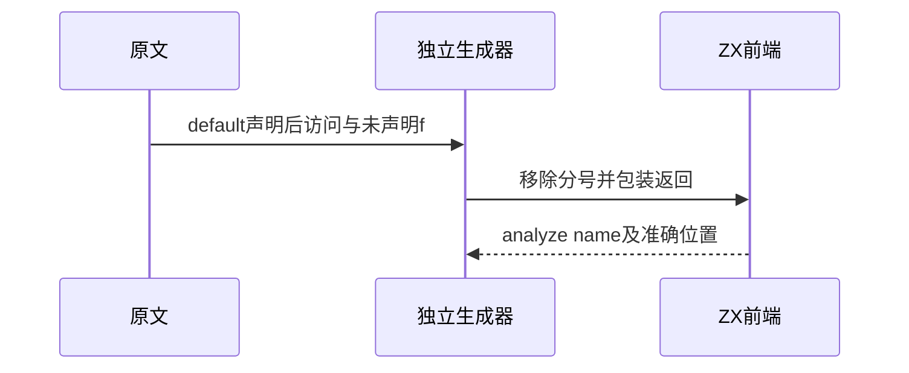

# Test262选择词法环境边界

## Intent：最终目标

逐份核对switch词法环境原文，将可保留的名称可见性断言接入前端测试，并区分闭包捕获与整块环境语义。

## Data：可用证据

完整读取scope-lex-const、scope-lex-let、open-case、open-dflt、close-case、close-dflt六份原文。特别是scope-lex-let实际没有let声明，只有空default及后续未声明f，不能依文件名假定已测试let。

## Edges：边界与限制

ZX采用分支局部绑定，不支持这些原文中的函数闭包、可变赋值与动态case。两份runtime ReferenceError负例适配为分析阶段name诊断；其余四份闭包环境原文不适用。

## Answer：交付与成功标准

新增两个精确名称诊断用例；六份原文哈希核验与完整参考执行；两份适配、四份排除分别记录。无分号源码不改动正在迁移的已有生成器。

## 实际结果

新增2个前端用例，`zig build test-frontend -Dfrontend-filter=language/statements/switch_environment/ --summary all`：5/5步骤、2/2用例通过，精确检查analyze name及x/f字符位置。

六份完整原文与固定索引SHA一致，两个负例得到ReferenceError，四个闭包环境用例共12项原始断言通过。完整参考执行没有改写正文。生成器--check、类型检查及本轮新增文件空白检查通过；四份正式文件已保存逐字一致副本，所有上游review路径无重复。

全局audit_matrix仍失败于既有addition/S11.6.1_A1.js的诊断位置不一致；与前阶段已反馈的问题相同，没有反复发送同一失败。未更新全局总数或声称全量通过。新增六份审阅中两适配、四排除；排除项不计ZX执行用例。

## 自我复核

const逃逸原文在运行阶段失败，ZX在分析阶段拒绝，因此只能称适配。let文件正文没有声明，新增f负例只是未声明名称基线，不证明let或词法环境创建实现。四个闭包原文不能借用现有分支局部绑定测试冒充覆盖；ZX的独立分支作用域与JavaScript整块环境须明确区分。

本轮没有生产源码修改，不覆盖并行迁移生成器；注册仅增加新生成器、seed依赖及一个前端目录。未运行浏览器或完整仓库回归；Context专属测试保持已移除状态。
