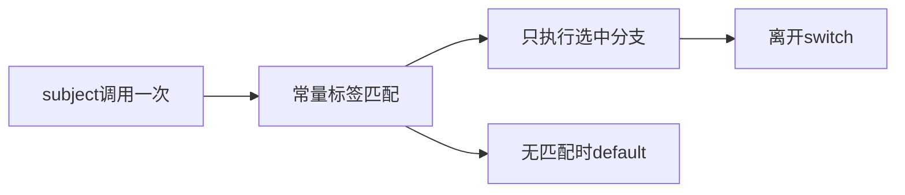
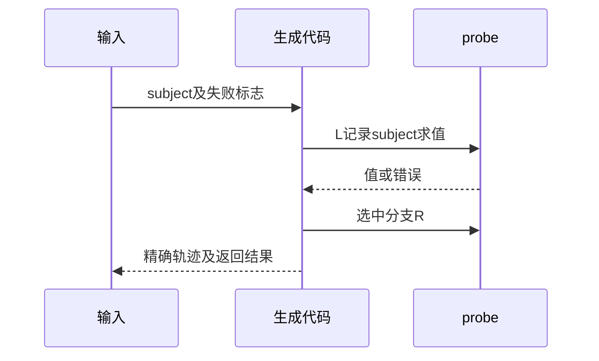

# Test262选择语句与实际求值

## Intent：最终目标

核验switch subject只求值一次、default位置不抢先命中以及分支不贯穿的ZX规则。

## Data：可用证据

当前分析器要求enum/整数/bool/string subject及常量case，重复case/default拒绝。后端将subject暂存，再按case顺序构造条件链，default作为尾部。完整读取三份语法原文；另外已读的复杂fallthrough样例暂不登记。

## Edges：边界与限制

ZX没有JS case贯穿与break语法；运行轨迹是ZX原生验证，不关联JS贯穿原文。float等subject限制独立检查。Context专项已移除。

## Answer：交付与成功标准

default前后、空switch、仅default、非贯穿五形态实际轨迹；三原文边界及标签/subject类型限制。严格核验调用次数、错误顺序和返回值。

## 实际结果

新增45项：36调用轨迹（default首/尾、仅default、非贯穿各8，空switch4），9前端（重复default、空subject、缺括号、重复case、动态case、四种非法subject）。运行确认subject单次调用，失败阻断分支；default位置不抢先执行；空switch仍求值subject；非返回分支不会贯穿。

`zig build test-switch-evaluation-order test-frontend -Dfrontend-filter=language/statements/switch --summary all`：27/27步骤45/45通过，日志 `/tmp/zxc-switch-statement.log`。三原文哈希/正文及解析SyntaxError通过，36轨迹独立JS控制流对照通过；非贯穿模型显式插入break，同时验证原样JS为LRR而ZX为LR。日志 `/tmp/zxc-switch-statement-reference.log`。

生成器--check、类型检查、覆盖审计、fmt及本轮diff通过。十三份正式文件与草稿字节一致。目录63850（前端5003、轨迹1068）；上游861/53597（530适配103等价228排除），剩余52736、关联4154。

## 自我复核

36运行案例是ZX原生覆盖，未关联到JS可变累加/贯穿原文。此轮只登记三份完整读取的语法负例；最初读取的其他switch大文件输出有截断，未将它们当成完整审阅或登记。

重复default在ZX分析阶段报告name，JS在parse阶段SyntaxError，差异如实记录。只测试default在两种位置与五种程序形态，不外推所有enum/string匹配、case规范化与穷尽性已覆盖。

未修改生产代码，未发现新实现缺陷，未运行完整入口；Context注入及其测试已移除。
