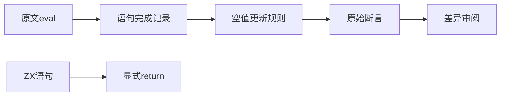
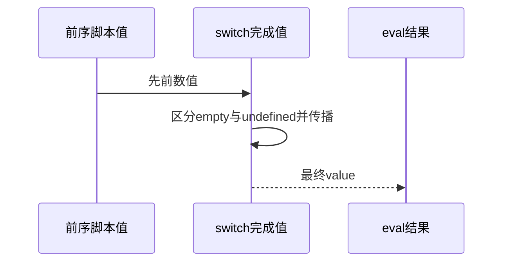

# Test262选择语句完成值边界

## Intent：最终目标

逐项核对switch完成值测试，不把语句完成值、函数返回值和分支结果混为一谈。

## Data：可用证据

21份cptn原文的可执行正文及规范摘录，固定索引SHA；全部用例通过eval观察正常或突变完成中的value。ZX AST/IR Statement没有普通表达式语句及可外部观察的Completion记录，switch作为语句、return显式返回Output。

## Edges：边界与限制

JS的empty不是undefined：空完成可继承前一个非空值，但空switch或无匹配switch返回undefined并覆盖之前脚本值。不能用ZX return常量或optional空值冒充该传播协议。break/continue及贯穿进一步构成差异。

## Answer：交付与成功标准

21份按实际分支形状和断言分别登记excluded；完整原文参考执行并保存每项实际值及预期值，核验SHA和断言数量。没有新增ZX预计算结果测试或扩大执行计数。

## 补充边界：尾调用

继续完整读取目录直属文件仅余的三份tco原文及tcoHelper。原文分别在带default的case、无default的case和default中尾位置自递归，onlyStrict并使用辅助文件定义的100000次调用。ZX IR契约明确禁止自递归与间接递归，三份另行登记excluded。不降低深度，也不以普通return或调用次数少的测试替代栈行为。

## 实际结果

21份完成值原文SHA与索引一致，完整参考执行92项断言全部通过；每个actual/expected按类型保存，undefined不丢失为JSON缺失值。三份尾调用原文SHA及tcoHelper SHA通过，但按onlyStrict和原100000深度执行均发生参考引擎RangeError栈溢出，最终callCount断言未执行，明确不记PASS。

本轮24份新增审阅均excluded，不新增ZX目录测试。全局审计通过：当前63,902案例（前端5,031、运行46,657，其余分类不变），本轮未新增案例，目录变化来自共享工作区其他更新；上游905/53,597已审阅，536适配、103等价、266排除，剩52,692；关联4,163。目录审计不验证全量执行。

递归索引核对：switch共有111文件，直属47份均已有审阅（9适配、38排除），syntax/redeclaration仍有64份未审阅。前序只用glob查看直属文件的剩余数不能代表整目录完成；已保存64项精确路径，下一步继续该子目录。

## 自我复核

cptn-abrupt-empty文件正文实际为空switch的正常完成，不根据名称误判为break等突变完成。空完成与undefined必须分开理解；不能用可选空值代替。尾调用参考引擎失败不构成ZX实现缺陷证据，ZX边界来自明确契约。

审阅记录正式副本一致，本轮未改生产源码或已有测试断言，不重跑无关专项、不声称完整对齐。Context专项保持已删除。
