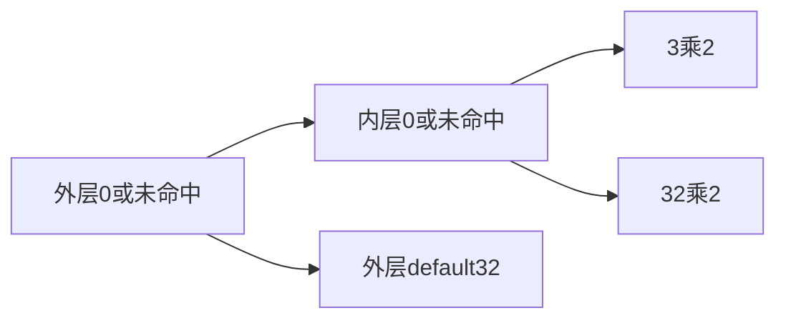
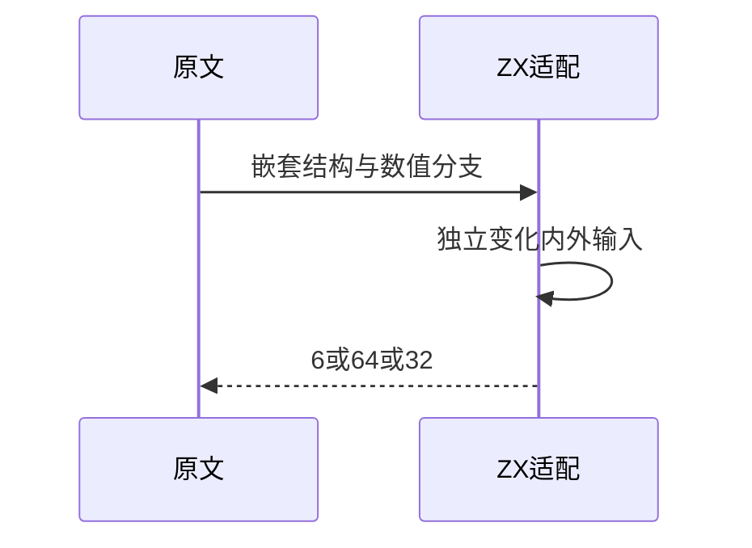

# Test262选择语句嵌套与结构边界

## Intent：最终目标

核验switch结构边界与嵌套选择，按无分号语法隔离真实结构错误。

## Data：可用证据

完整读取三份语法负例和一份嵌套原文。原文嵌套输入0得到6，外部不匹配走32；内层默认32随后乘2的路径在拆分内外输入后可独立观察。

## Edges：边界与限制

移除原文终止分号属于明确语法适配，不在分号处提前拒绝冒充结构检查。ZX没有原文可变局部、break与不可达赋值，使用直接返回等值表达式，仅验证嵌套选择。Context专项已移除。

## Answer：交付与成功标准

三结构诊断、四嵌套运行；原文哈希与完整参考执行、独立分支对照。同步拆分接近1000行的覆盖清单，保存旧记录不丢失。

## 实际结果

新增7项：三结构错误精确syntax/span，四嵌套运行返回6/64/32。`zig build test-switch-nested test-frontend -Dfrontend-filter=language/statements/switch_nested --summary all`：17/17步骤7/7通过，日志 `/tmp/zxc-switch-nested.log`。

四原文哈希/正文核验：三个SyntaxError，一个完整参考执行；原始SwitchTest(0)=6、SwitchTest(1)=32通过，拆分内外输入的四个输出独立执行一致。生成器--check、本轮新增文件空白检查及构建文件fmt通过，五份正式文件与草稿一致。

覆盖清单第一册原986行已按阶段201切开，166行历史内容完整移至第二册，原文件增加续接链接；第二册保留反向链接。没有删除历史记录。

## 全局检查未通过

无分号迁移仍进行中。pnpm typecheck在既有if_nested/if_statement/return_statement生成器报frontend隐式any[]，switch_scalars报string|null不兼容。audit_matrix报旧加法review诊断位置不匹配；进一步只读核对发现357条review诊断span与对应case.span不同，已保存完整明细与失败日志并反馈实现会话。

本轮不改写并行迁移中的历史生成器、不把这些失败宣称通过；全局目录总数暂不更新。四项新上游记录已写入，但全部记录的完整审计仍待迁移一致后通过。

## 自我复核

嵌套源码的内外输入分离属于扩展，不能声称原文实际走到了内层default。原文break之后的不可达赋值没有移植；只验证支持的选择与算术子集。结构负例移除终止分号是为了不在无关的分号规则提前失败，转换明确记录。

未修改生产实现或运行完整入口，Context专项已删除。专项通过与全局迁移未完成同时成立，不互相替代。
