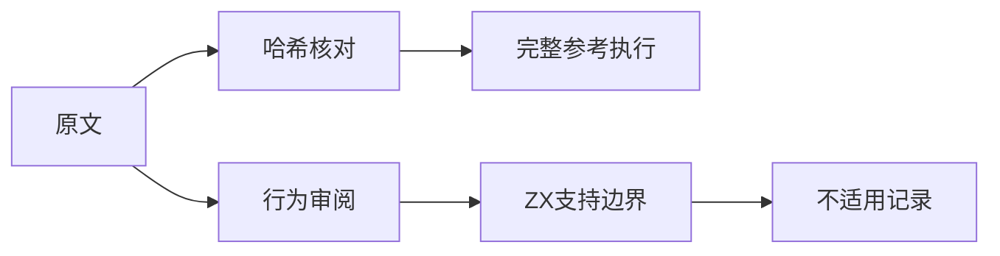
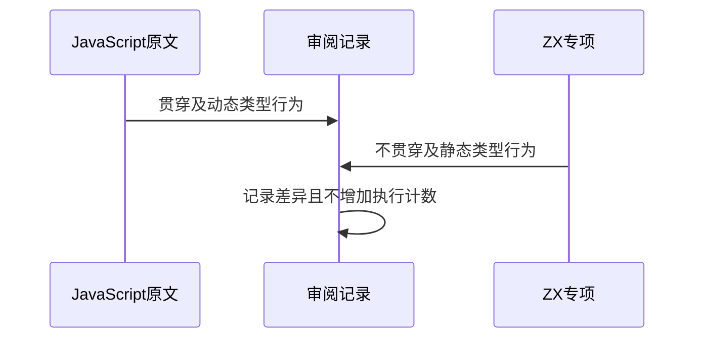

# Test262选择贯穿语义边界

## Intent：最终目标

完整核对S12.11_A1_T1至T4，不用预计算返回值冒充分支贯穿、动态标签和对象身份测试。

## Data：可用证据

固定快照四份完整原文、上游索引哈希、ZX switch分析器及现有实际调用轨迹测试。原文包含多类型输入、重复标签、Number包装对象、NaN/Infinity、isNaN函数和函数调用标签。

## Edges：边界与限制

ZX选择主体只接受枚举、整数、布尔、字符串；标签静态同型，分支不贯穿。不把JavaScript动态模型的不适用视为实现缺陷，不增加针对原文结果的硬编码。

## Answer：交付与成功标准

四份独立审阅记录为excluded，空cases不计本地执行案例；每份核验SHA并执行未修改原文全部断言。复跑现有ZX选择语句边界和调用轨迹，分别报告原文执行与ZX执行。

## 实际结果

四原文逐份与固定索引SHA-256一致，完整未修改原文在独立JavaScript上下文执行，10+11+12+9共42项原始断言通过。四份审阅为excluded，正式文件与审阅草稿逐字一致，未新增本地测试或扩大运行覆盖。

当前ZX组合专项20/27构建步骤完成，已执行33/33通过（9前端、24调用轨迹）。empty与no_fallthrough两份源码被spacing检查拦截，该两组没有执行，不以33/33表述整套通过。具体日志及现场哈希保存在选择贯穿语义复核目录，问题已反馈实现会话同步迁移生成器与产物。

类型检查通过；全局审计仍失败于既有addition/S11.6.1_A1.js的review诊断span。全局目录总数继续保留最近通过的基线，不报告当前全量通过。

## 自我复核

T1的普通整数分支也依赖贯穿，不能因为ZX支持整数选择就将整份标为适配；T2的包装对象身份、T3的NaN不自等与贯穿、T4的函数身份和动态调用标签均是目标行为。上游参考执行成功不等于ZX执行成功。excluded表示当前语言设计边界，若未来扩展语义应重新审阅。

本轮未修改生产源码或并行迁移文件。文档遵循IDEA并含架构和数据流图；Context专项保持已移除状态。
