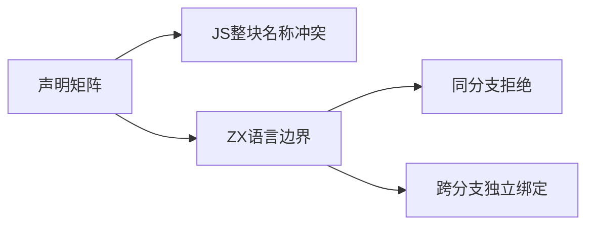
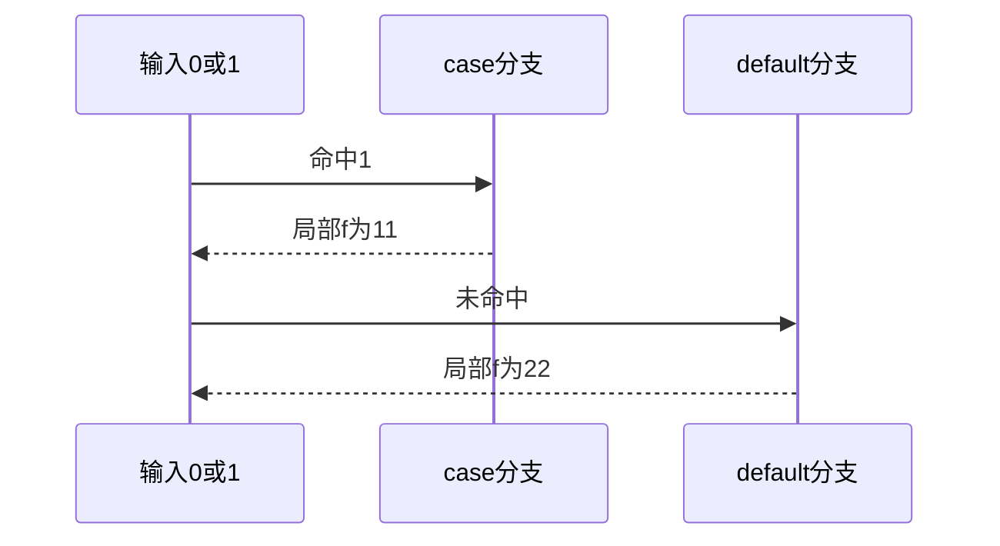

# Test262选择重复声明矩阵

## Intent：最终目标

逐项审阅八种声明形成的64项switch跨分支重复声明矩阵，验证ZX独立分支作用域与同一分支重复绑定的区别。

## Data：可用证据

64份完整可执行正文与negative元信息已读：63项parse SyntaxError，var/var一项为合法程序。const/const原文虽然两种声明都被ZX支持，但JS整块词法环境禁止跨分支重名，ZX独立分支允许重名。

## Edges：边界与限制

不把不支持声明的入口拒绝冒充重名检测；不把跨分支独立绑定冒充JS整块作用域。64项均excluded，ZX原生同分支拒绝和跨case/default合法绑定独立计数。

## Answer：交付与成功标准

六十四份哈希与参考解析/执行；新增两合法前端、两同分支重名诊断及四条真实运行输出。与固定递归索引核对switch全部111份有审阅，但审阅完毕不代表JS语义兼容。

## 实际结果

新增8项ZX案例：两个合法前端、两个同分支重名name诊断、四个运行值11/22。组合既有四项作用域运行：29/29步骤12/12通过。独立JS对照从实际ZX函数体加入分支显式块以建模ZX局部作用域，四结果及两个f位置通过，不称原始JS跨分支const代码合法。

64份原文SHA与索引一致，完整解析按元信息运行：function/function仅strict，另63文件sloppy与strict各一次，共125次SyntaxError预期及两次var/var正常执行通过。var/var另在相同VM上下文直接读取f为undefined，不依赖宿主对象属性是否物化。

生成器--check、类型、构建格式与本轮新增文件空白检查通过。七正式副本与当前产物逐字一致。全局审计通过：63,910目录案例（前端5,035、运行46,661），上游969/53,597（536适配、103等价、330排除），未审阅52,628，关联4,163。

递归索引证明switch全部111份均有审阅，9适配、102排除。此处完成的是审阅分类，不是JavaScript完整switch兼容；排除项均保留逐项原因。

## 迁移修复复验

上轮五个if spacing阻塞已消除：if轨迹与前端组合39/39步骤235/235通过，已通知实现会话。该结果不替代其正在执行的完整测试包回归。

## 自我复核

首次参考脚本漏读function/function的onlyStrict，随后完整提取64份flags/features并按严格模式运行，保留失败日志。宿主context对象属性检查不能证明VM变量绑定，改为同VM直接读取变量；独立ZX对照脚本首版在第一个case前错误闭合括号，修复后四运行对照通过。上述均为参考核验脚本问题，没有改动原文或ZX预期来凑通过。

不将64个不支持语义登记为等价或适配，不为复用原文而把var改成const。没有生产源码修改或浏览器操作；Context专项保持已删除。
