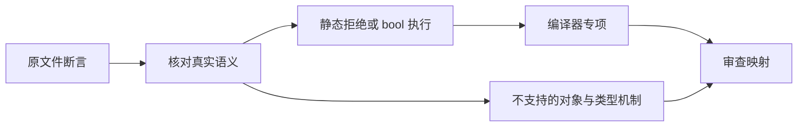
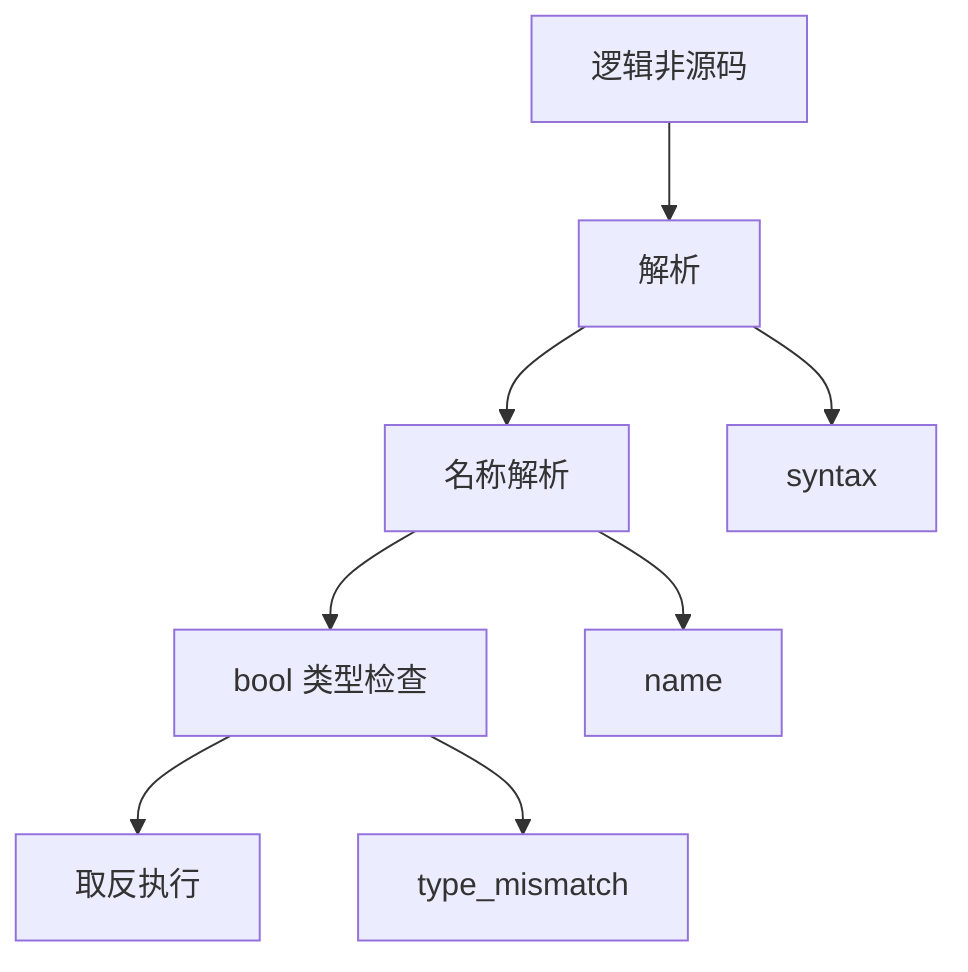

# Test262 逻辑非转换边界

## Intent：最终目标

逐项审查 logical-not 剩余十个上游文件，完善 bool-only 静态操作数边界。区分数字值、未绑定全局名、空对象和不支持的源语法。

## Data：可用证据

已读取固定上游十个原文件。现有 generate_logical_not.ts 覆盖 bool 执行和数值、string、object、optional_bool、void 类型拒绝。ZX IR 契约明确规定逻辑非只接受 bool。

## Edges：边界与限制

ECMAScript 对普通对象的 ToBoolean 总为真，不调用 valueOf/toString；旧上游 info 写 uses Default Value 不能当作实际语义。ZX 没有对象真值转换；不将数值操作数换成 bool 后冒称原测试等价。包装对象、Symbol、任意精度 BigInt 分别记录边界。

## Answer：交付与成功标准

追加精确操作数形状的真实前端案例，复用已有 bool 执行断言。逐文件校验哈希、记录适配/排除理由与关联案例，运行对应专项和目录审计。

## 执行结果与自我批判

新增 11 个真实前端案例：undefined、void 运算符、空对象、function 表达式、eval、NaN/Infinity 未绑定名称、三种浮点除法操作数及可选数值。前端专项 **5/5 步骤、3,138/3,138 测试通过**，日志 `/tmp/zxc-not-conversion.log`；TypeScript、生成一致性、目录审计和 diff 检查通过。已有 !false 执行案例复用阶段 80 的普通执行专项结果，本轮未改动运行时案例。

十个上游原文件哈希逐一核验，新增 6 adapted、4 excluded。logical-not 目录未审阅数为零。累计 304/53,597 已审阅（169 adapted、102 equivalent、33 excluded），未审阅 53,293，唯一关联案例 990。登记案例 57,132：runtime 42,516、frontend 3,138、evaluation_order 332、safety 464、module_graphs 10,446、stores 236。没有生产修改或新实现缺陷，最近本会话完整根仍为阶段 75。

自我批判：浮点除法操作数案例只证明分析期的 bool 类型边界，并没有在运行时产生或观察 NaN/Infinity；本轮不能作为 IEEE 执行行为的新证据。四个 excluded 文件分别读取了对象方法不被调用、十九种构造对象、三个 BigInt 值和 Symbol 分支的具体断言。排除仅反映当前选定静态契约，不代表这些原 JavaScript 行为通过；适配也明确记录混合文件中尚不提供的包装对象部分。
