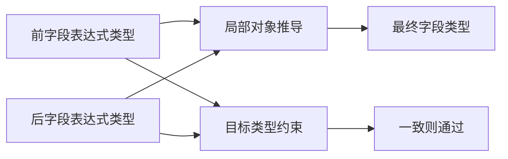
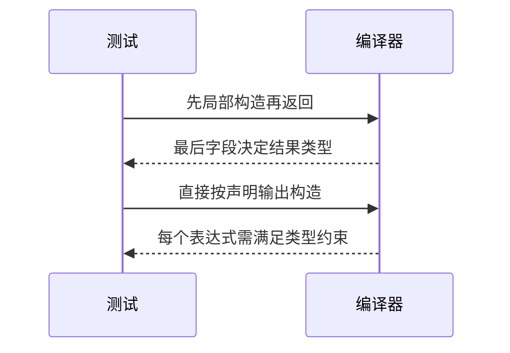

# Test262重复对象字段与类型约束

## Intent：最终目标

验证重复对象字段最终值及静态类型推导/目标类型构造的边界。

## Data：可用证据

完整读取object目录5份原文，重复foo:0,foo:1检查最终1；其余涉及getter/setter、eval语法或Object.prototype只读属性。当前aggregates.object先分析每个表达式，再替换同名最终字段。

## Edges：边界与限制

只对普通重复数据字段建立运行关联，getter/setter与原型不适配。静态类型矩阵属于ZX扩展；根据类型推导与显式目标类型规则分别判定，不以JS动态类型替代。Context相关测试不运行。

## Answer：交付与成功标准

5个动态重复字段运行案例（含原0/1组合），4种字段类型×4种最终类型×2种构造上下文的32项前端检查。验证推导成功、直接目标类型冲突及精确类型结果，保留失败证据。

## 实际结果

新增37项：5个动态覆盖运行与32个前端类型矩阵。类型为u64、bool、string、u64[]；前一个值与最后值各有4种。局部对象推导16项全部通过；直接按输出类型构造4项同型通过、12项异型type_mismatch拒绝。表达式先绑定明确类型，避免数值字面量受目标类型提示影响对照。

运行案例输入(0,1)复现原文最终foo为1，其余覆盖零、相同值及不同较大数值。目标程序实际构造两个同名字段再读取foo，没有直接返回测试预期。原文eval包装未移植；4份访问器/原型用例明确排除。

`zig build test-object-construction test-frontend -Dfrontend-filter=language/types/object_duplicate --summary all`：25/25步骤43/43通过（37新增+6既有字段值），日志 `/tmp/zxc-object-duplicate.log`。生成器--check、TypeScript及审计通过，日志 `/tmp/zxc-object-duplicate-{check,typecheck,audit}.log`。

独立参考执行5份原文并验证SHA256，共8个显式断言；无断言的eval语法文件只记录执行未抛错。5项运行预期通过独立JS对象构造核对；32项目录完整性检查确认20个接受和12个类型拒绝，但不将JS动态执行用作ZX静态类型预期。日志 `/tmp/zxc-object-duplicate-reference.log`。5份正式文件与草稿字节一致，本次diff通过。

目录63471（前端4824、普通运行46597），上游696/53597（440适配、103等价、153排除），剩余52901、关联3885。没有新发现生产缺陷，没有修改编译器。

## 自我复核

局部推导与目标类型构造的区别是静态类型规则，不是JS重复属性规则的直接移植；32项矩阵不关联冒充上游访问器检查。前端通过不代表本轮实际运行所有跨类型对象，只有5个数值覆盖案例具有本轮运行证据。Context测试未运行，历史legacy失败的修复尚无本轮复验结果，完整目标仍未完成。
