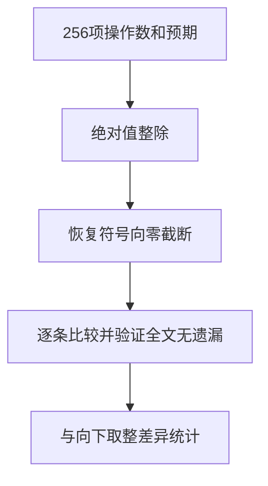

# Test262除法剩余协议审阅

## IDEA

- Intent：完成除法剩余九个原文件的协议审阅，明确BigInt向零截断、除零异常及动态转换缺口。
- Data：锁定原文、SHA-256、当前固定宽度数值契约；全部256项算术独立核验。
- Edges：不新增ZX执行案例，不把审阅或excluded当作上游运行通过；不以i64或浮点代替BigInt。
- Answer：九条逐文件理由、可复现全量检查、目录审计、未审阅查询及自我批判。




## 逐文件证据

| 文件 | 原始要求 | 当前结论 |
| --- | --- | --- |
| A2.2_T1 | 8项valueOf/toString优先、回退、对象结果与异常 | 动态DefaultValue不存在 |
| A2.3_T1 | 两侧valueOf抛错时左ToNumber优先 | 不能用普通调用次序证明隐式转换 |
| bigint-and-number | 20项混合类型TypeError | 无BigInt和ToNumeric类型分派 |
| bigint-arithmetic | 16个非零操作数的256个有序对 | 任意精度与负数范围不能由固定64位等价替换 |
| bigint-complex-infinity | 1、10、0、1000000000000000000的BigInt值除0n，四个RangeError | 不以固定整数安全终止或浮点无穷替代 |
| bigint-errors | 10个Symbol及三种转换返回Symbol的TypeError | 无Symbol和动态转换协议 |
| bigint-toprimitive | 20成功值、24异常，优先/回退/非callable/非原值/抛错 | 对象转换链不可表达 |
| bigint-wrapped-values | 8个包装与拆箱左右位置 | 不以普通常量替代包装身份 |
| order-of-evaluation | 6异常及6轨迹，GetValue/ToPrimitive/ToNumeric分层 | 普通调用只覆盖部分行为，整文件不标等价 |

## 执行结果

独立校验提取全部256项断言，移除断言和注释后正文无剩余。操作数集合为16个非零值，全部有序对覆盖。先做abs(a)//abs(b)再按符号恢复，全部与原预期一致；90项与Python向下取整不同。结果范围±18364758544493064720。另核对除零四项原断言分子与RangeError要求。

初始集合检查误假定分子还包含零，脚本拒绝；按实际集合纠正为16×16并验证完整笛卡尔积，没有仅修改数量放过缺项。

命令：

```sh
python3 docs/2026-10-04/除法协议审阅/审阅校验.py /tmp/zxc-test262-reference/test262-7ab7fafa0003f73fc85c1b95d88094d33f7eb8bd
```

日志 `/tmp/zxc-division-protocol-review.log`。这不是ZX执行结果。审阅记录保存至 `packages/test/upstream/reviews/language/expressions/division_protocols.jsonl`。

## 自我批判

九条excluded只记录真实缺口，不消除完整对齐目标中的工作。与ZX同为向零截断不足以说明BigInt兼容：范围、混合类型、包装、动态转换与除零异常都不同。未来语言契约改变时必须重审。除法目录未审阅归零也不代表语义全部实现。

最新完整根阶段122，阶段125四个legacy失败本轮未回归；没有生产修改，也没有因为只改审阅记录重复运行编译。

目录审计与剩余查询均通过，日志 `/tmp/zxc-division-protocol-audit.log`、`/tmp/zxc-division-remaining.log`。除法matched_unreviewed=0。目录仍62,036，上游461/53,597（300 adapted、102 equivalent、59 excluded），未审阅53,136，唯一关联2,538。diff与审阅草稿一致性通过。
