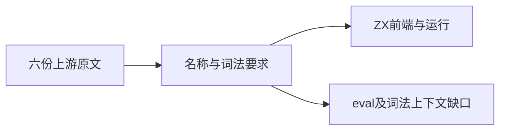
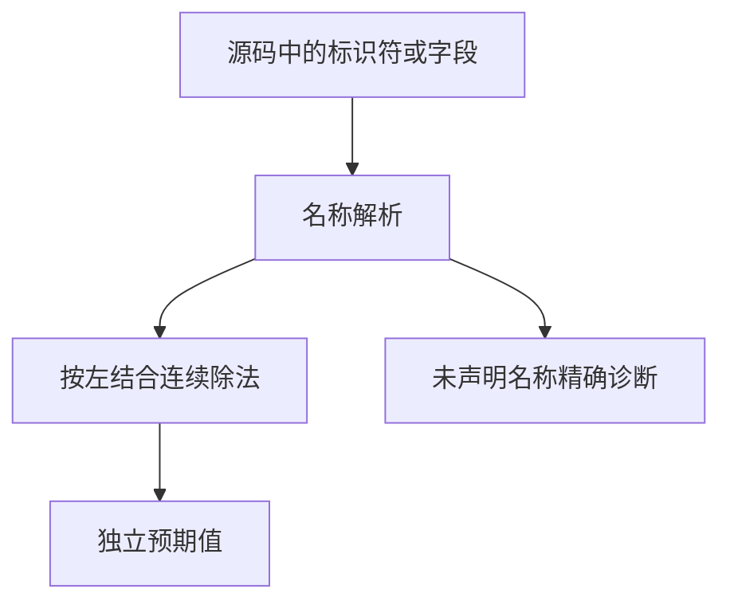

# Test262除法名称与词法上下文验证

## IDEA

- Intent：补齐除法GetValue、未声明名称、跨行运算与标识符/斜杠上下文的真实证据。
- Data：A2.1三文件各5/1/1项要求、line-terminator的18/2/9、no-magic-asi的instance/of/g，以及block-eval完整原文。
- Edges：静态字段对象代替JS构造器只适配字段读取；名称错误在编译期；不声称动态eval、ASI或正则语法兼容。
- Answer：四个前端名称案例、六个真实运行案例、六份逐文件审阅和校验日志。block-eval明确记录未实现协议。

## 结果

新增10个登记案例：4个名称前端、6个普通运行。六份上游记录包括5条adapted、1条excluded。

- 数值输入-2、1、2、3分别检查literal、left、right、both、fields五种读取位置；输入1保留上游全部数值预期。零值不在这一取值形状组中，不能据此推断除零行为。
- 未声明名称位于左右两侧时，检查完整missing跨度；同位置已声明版本必须通过。
- 保留18跨行/2跨行/9，执行得到1；保留instance/of/g的无空格斜杠串，执行得到5。
- block-eval要求动态eval与块后词法上下文切换，明确excluded；没有用普通0.8/4/2冒充原断言。

最终 `zig build test-frontend test-runtime --summary all`：1,017/1,017步骤、50,078/50,078测试通过，日志 `/tmp/zxc-division-names-final.log`。

首次执行一个用例将JSON null传给void，导致测试生成模块类型错误；改为同职责既有模式的u8占位输入0，场景不读取该输入。另一次审计拒绝了嵌套field路径写法，改为整个value对象预期后通过。两项都是测试接入错误，没有修改生产或误报缺陷。

独立脚本 `除法名称审阅/审阅校验.py` 核验六份哈希、四组对象预期、名称跨度及两种词法源码形状。包级TS、生成器--check、目录审计、diff和9份草稿一致性通过。草稿在 `docs/2026-10-04/除法名称测试草稿/`。

目录62,036：前端3,855、普通运行46,223、调用轨迹812、安全464、RX模块10,446、Store236。上游452/53,597（300 adapted、102 equivalent、50 excluded），未审阅53,145，唯一关联2,538。日志 `/tmp/zxc-division-names-audit.log`。

## 自我批判

静态对象字段不是JS动态对象协议；编译期name不是运行期ReferenceError；ZX无正则语法，因此instance/of/g通过也不证明JS的正则歧义消解。本轮只建立原读取/连续除法可表达部分的适配证据。excluded留下真实能力缺口，不等于用户完整目标完成。

最新完整根仍阶段122，阶段125四个legacy失败本轮未回归。

