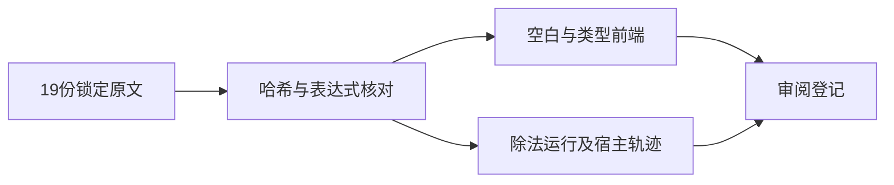
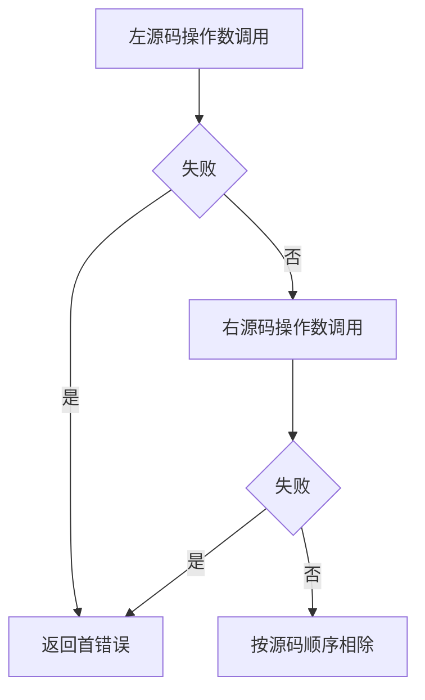

# Test262除法空白转换与顺序验证

## IDEA

- Intent：逐项对齐除法A1、A3及A2.4共19个上游文件，覆盖词法位置、静态转换边界和调用顺序。
- Data：锁定原始文件全部10项空白、72项转换和四文件赋值/throw断言；现有真实探针left=2/right=3。
- Edges：不声明隐式ToNumber、包装对象、Unicode空白或赋值副作用兼容。浮点除法结果按2/3与3/2独立计算，不沿用乘法结果。
- Answer：136前端、54普通运行、16调用轨迹，共206案例；19条审阅、独立校验、专项日志和草稿。

## 证据与差异

A1与乘法具有相同十组空白，但运算符为除法；逐项重新核对。A3包含null/null为NaN及1/null为正无穷，与乘法预期不同；ZX保留原表达式做静态类型拒绝，不能冒充上述动态转换结果。A2.4的两种赋值位置结果为1和0，未声明读产生ReferenceError，隐式全局要求非严格模式；ZX相应表达式解析拒绝。双throw适配为独立宿主错误，直接/绑定及正反顺序均保留。

## 结果

新增206个案例：136前端（72转换、60空白、4赋值）、54普通运行、16调用轨迹。19条adapted记录关联全部案例。

执行 `zig build test-frontend test-runtime test-evaluation-order --summary all`：1,046/1,046步骤、50,881/50,881测试通过，日志 `/tmp/zxc-division-boundary.log`。没有生产源码修改或新缺陷通知。

独立核验脚本 `除法边界审阅/表达式校验.py` 与 `顺序校验.py` 核验19份上游哈希、全部72转换表达式、10项空白序列、16个轨迹组合和4个等号诊断位置。除法A3中的Number.POSITIVE_INFINITY分支已单独纳入提取，不能套用乘法结果。日志 `/tmp/zxc-division-expression-review.log` 与 `/tmp/zxc-division-order-review.log` 均通过。

目录审计62,026：前端3,851、普通运行46,217、调用轨迹812、安全464、RX模块10,446、Store236。上游446/53,597已审阅（295 adapted、102 equivalent、49 excluded），未审阅53,151，唯一关联2,528。日志 `/tmp/zxc-division-boundary-audit.log`。

包级TypeScript检查、三个生成器--check、diff与13份草稿一致性通过。草稿保存在 `docs/2026-10-04/除法边界测试草稿/`。正式文件按空白、转换、赋值和求值顺序分组，根构建按原目录接入。

## 自我批判

空白执行用除1隔离词法行为，不代替除零、溢出或舍入边界。调用轨迹用2/3与3/2同时识别值和顺序。原ToNumber产生NaN/Infinity的案例在ZX中静态拒绝，属于有明确差异的适配，不能宣称这些原断言已在ZX执行。JS赋值、副作用、隐式全局和任意throw仍不在本轮实现范围。

本轮专项虽覆盖三类执行器，仍不是完整根回归；最新完整根阶段122，阶段125四个legacy失败未回归。

