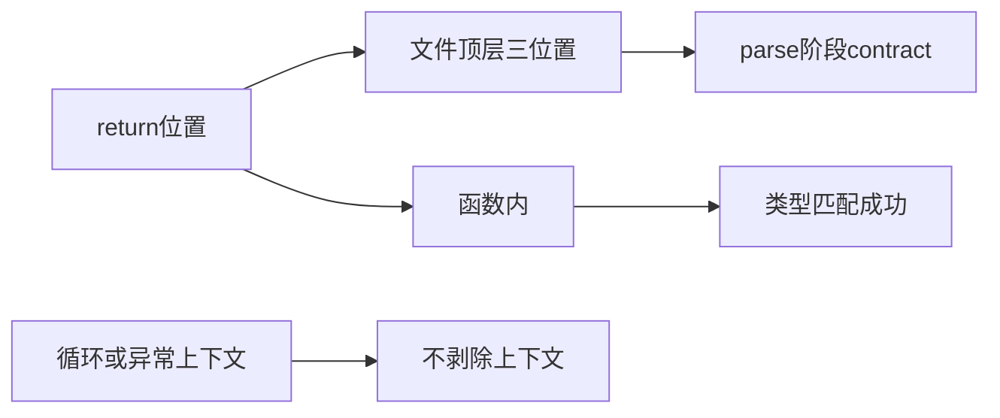
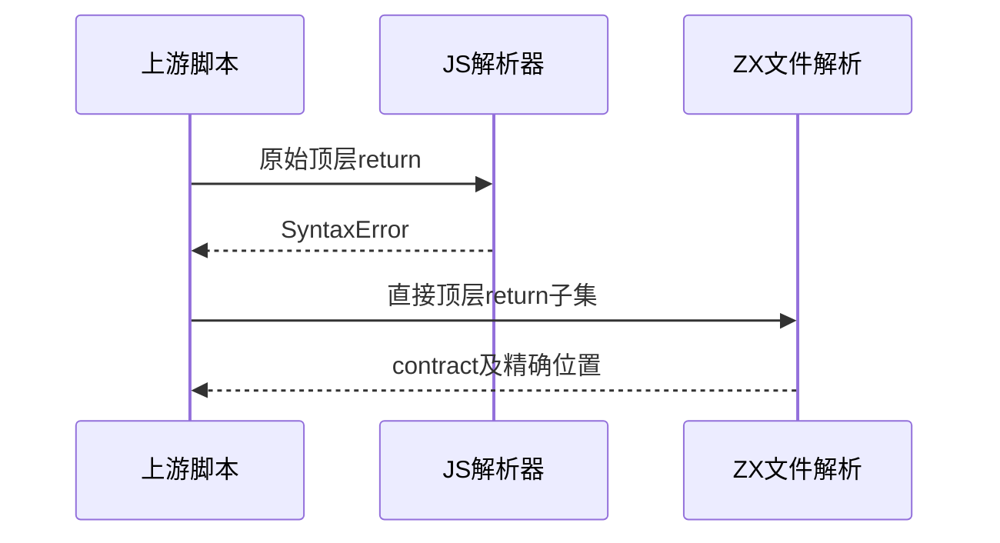

# Test262顶层返回与目录复核

## Intent：最终目标

核验顶层return拒绝，并完成return目录审阅。保持原文的return所在层级，不将非法脚本包装进函数后宣称通过。

## Data：可用证据

完整读取剩余11原文。ZX parser_top在解析完合法文件结构后，对剩余token报告contract，因此顶层return的诊断是解析阶段contract，而非语句内部syntax。

## Edges：边界与限制

含var、顶层块、do循环与try/catch的原文不剥除这些结构冒充完整规则覆盖。十万次尾调用不缩短。Context注入测试已移除。

## Answer：交付与成功标准

return;与return(0)各在空文件、类型声明后、完整函数后三位置被拒绝，函数内两个合法对照。按真实JS脚本验证十个非法顶层返回，记录尾调用参考限制，并重新枚举目录覆盖。

## 实际结果

新增8前端：return;与return(0)分别在空文件、声明后、函数后三位置parse contract拒绝，两个函数体内analyze成功对照。`zig build test-frontend -Dfrontend-filter=language/statements/return_top_level --summary all`：5/5步骤8/8通过，日志 `/tmp/zxc-return-top-level.log`。

11原文哈希和正文核验。十个原始脚本均解析SyntaxError，而仅用于对照的函数包装可解析，证明不能用Function构造器替代脚本来验证顶层return。尾调用保持真实tcoHelper的100000次，在Node参考环境RangeError，未宣称通过。日志 `/tmp/zxc-return-top-level-reference.log`，尾调用结果另存草稿目录。

本批2适配9排除；return目录16份全部审阅，6适配10排除、0未审阅。生成器--check、类型检查、审计、fmt及本轮diff通过；三份正式文件与草稿字节一致。目录63805（前端4994）；上游858/53597（527适配103等价228排除），剩余52739、关联4151。

## 自我复核

var、顶层块、do/try/catch八份不拆掉外壳后复用直接return测试，避免漏掉原本结构还声称覆盖。两个函数内对照属于ZX补充，不关联上游非法脚本。

顶层诊断发生在parse阶段，但类别是contract，依据当前parser_top源码并由测试验证，未因JS元数据写SyntaxError就机械指定syntax。目录全部登记不等于语义全部实现。未修改生产实现、未运行完整入口，Context注入测试已移除。
